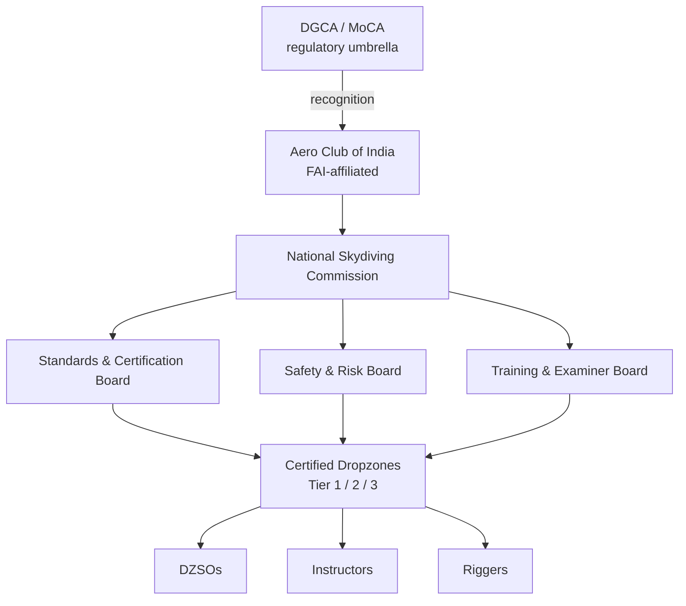
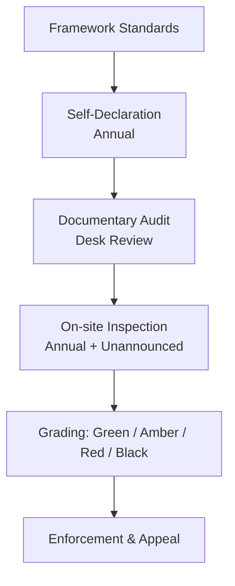
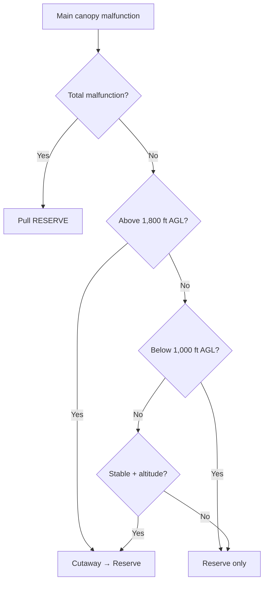
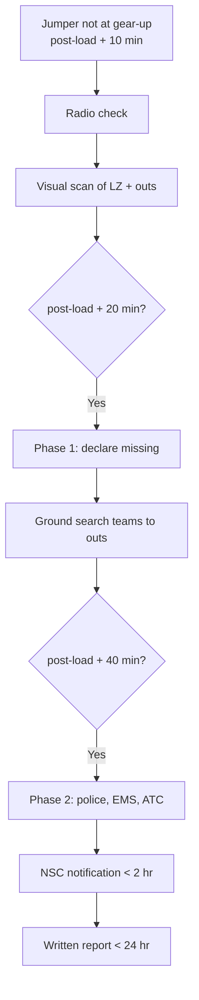
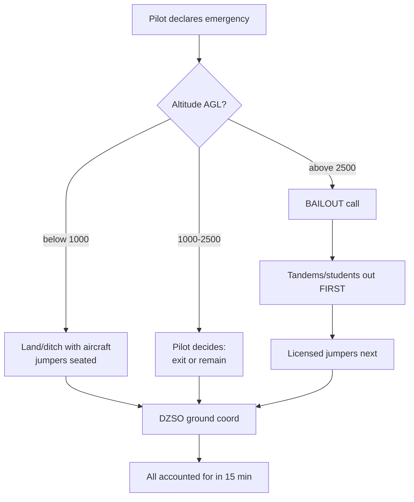
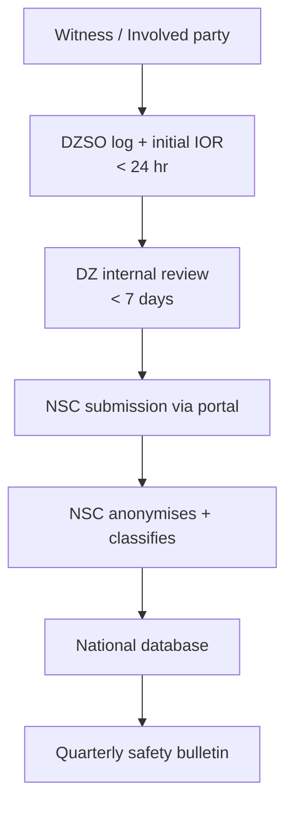
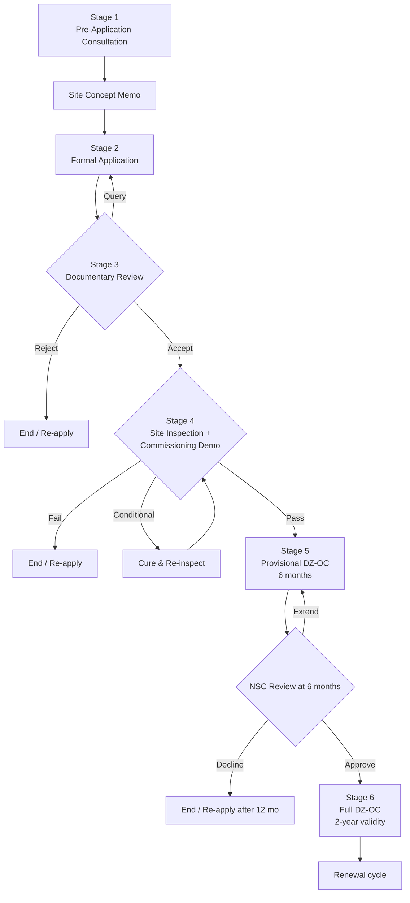

# NATIONAL FRAMEWORK FOR CIVILIAN SKYDIVING DROPZONE OPERATIONS IN INDIA

**Draft v0.1 — Working Group First Draft**
**Aero Club of India (ACI) — Skydiving Working Group**
**Status:** Internal WG Draft — Not for External Circulation
**Date of Draft:** _[Insert WG Issue Date]_
**Document Owner:** ACI Skydiving WG Chair

---

## DOCUMENT CONTROL

| Item | Detail |
|---|---|
| Document Title | National Framework for Civilian Skydiving Dropzone Operations in India |
| Version | 0.2 (First WG Draft + Site Certification) |
| Classification | WG Internal — Restricted |
| Issuing Authority | Aero Club of India — Skydiving Working Group |
| Review Cadence | Bi-weekly during 60-day drafting; annual post-publication |
| Supersedes | None (foundational document) |
| Related Documents | DGCA CAR Section 9, AAI AIP India, FAI Sporting Code Section 5, USPA SIM, APF Operational Regulations, CSPA PIM |

### Revision History

| Version | Date | Author/WG Sub-group | Summary of Changes |
|---|---|---|---|
| 0.1 | TBD | WG Drafting Team | Initial broad-skeleton draft across all 9 Parts |
| 0.2 | TBD | WG Drafting Team | Added Part 2A — New Dropzone Establishment & Site Certification (mandatory/recommended specs, application process, provisional DZ-OC, transition for existing DZs) |

### Glossary of Key Acronyms

| Acronym | Expansion |
|---|---|
| AAD | Automatic Activation Device |
| AAI | Airports Authority of India |
| ACI | Aero Club of India |
| ADS-B | Automatic Dependent Surveillance–Broadcast |
| AFF | Accelerated Freefall |
| AGL | Above Ground Level |
| AME | Aircraft Maintenance Engineer |
| AMSL | Above Mean Sea Level |
| APF | Australian Parachute Federation |
| ATC | Air Traffic Control |
| BPA | British Parachute Association (now British Skydiving) |
| CAR | Civil Aviation Requirement (DGCA) |
| CSPA | Canadian Sport Parachuting Association |
| DGCA | Directorate General of Civil Aviation, India |
| DZ | Dropzone |
| DZSO | Dropzone Safety Officer |
| FAI | Fédération Aéronautique Internationale |
| FFI | Foreign Federation Identifier |
| HEMS | Helicopter Emergency Medical Services |
| IAF | Indian Air Force |
| IRM | Instructional Rating Manual |
| MEL | Minimum Equipment List |
| NOTAM | Notice to Airmen |
| PIC | Pilot-in-Command |
| PIM | Parachuting Information Manual (CSPA) |
| RPS | Reserve Parachute System |
| SIM | Skydiver's Information Manual (USPA) |
| SMS | Safety Management System |
| SOP | Standard Operating Procedure |
| TSO | Technical Standard Order (FAA) |
| USPA | United States Parachute Association |
| WG | Working Group |

---

## EXECUTIVE PREAMBLE

Civilian skydiving in India today operates without a unified national framework. Existing operations rely on episodic DGCA permissions, state-level approvals, and the personal experience of operators — most of whom hold foreign ratings (USPA, APF, BPA). The result is uneven safety, inconsistent training, fragile insurance relationships, and a fragmented regulatory perimeter that constrains the sport's growth.

This Framework is the first comprehensive attempt to codify, in one document, the **Standard Operating Procedures, Operational Policies, Training Standards, Safety Frameworks, Risk Management protocols, Compliance Mechanisms, and Governance Models** required to operate civilian skydiving dropzones safely and sustainably in India.

The Framework is built on three design principles:

1. **Operational Realism.** Every standard is calibrated against Indian infrastructure, medical-evacuation timelines, monsoon climatology, airspace congestion, and instructor availability — not aspirational benchmarks divorced from field reality.
2. **International Benchmarking.** Practices are anchored to USPA, APF, CSPA, and FAI norms, with explicit "Gold Standard" and "India-Realistic Minimum" tiers wherever the gap is material.
3. **Phased Maturity.** The Framework defines a staged maturity ladder so the ecosystem can credibly progress from Day-1 minimums toward global gold standards over a 5–10 year horizon.

The Framework adopts a **self-regulatory model** in which the Aero Club of India, supported by an empowered National Skydiving Commission, sets and enforces standards by reference, while DGCA retains airworthiness, airspace, and aircraft-operation authority. This is structurally analogous to the APF–CASA relationship in Australia and the USPA–FAA relationship in the United States.

---

## TABLE OF CONTENTS

- [Part 1 — Working Group Action Plan](#part-1--working-group-action-plan)
- [Part 2 — National Skydiving Operations Framework](#part-2--national-skydiving-operations-framework)
- [Part 2A — New Dropzone Establishment & Site Certification](#part-2a--new-dropzone-establishment--site-certification)
- [Part 3 — Dropzone Operations SOPs](#part-3--dropzone-operations-sops)
- [Part 4 — Training & Certification](#part-4--training--certification)
- [Part 5 — Safety & Risk Management](#part-5--safety--risk-management)
- [Part 6 — India-Specific Operational Constraints](#part-6--india-specific-operational-constraints)
- [Part 7 — Checklists & Templates](#part-7--checklists--templates)
- [Part 8 — Compliance & Audit](#part-8--compliance--audit)
- [Part 9 — Implementation Roadmap](#part-9--implementation-roadmap)
- [Appendix A — Mermaid Diagram Source](#appendix-a--mermaid-diagram-source)
- [Appendix B — Reference Standards Crosswalk](#appendix-b--reference-standards-crosswalk)
- [Appendix C — Open Questions & Parking Lot](#appendix-c--open-questions--parking-lot)

---

# PART 1 — WORKING GROUP ACTION PLAN

## 1.1 Purpose of Part 1

To define the operating rhythm, deliverable structure, governance, and stakeholder engagement plan that the WG will follow over its 60-day drafting window so that the Framework reaches a regulator-ready first draft on schedule.

## 1.2 WG Composition (Recommended)

| Seat | Role | Rationale |
|---|---|---|
| Chair | Senior aviation/sports administrator | Convening authority, single point of accountability |
| Vice-Chair (Operations) | Active DZ operator (Indian or returning expat) | Operational realism anchor |
| Vice-Chair (Safety) | Senior S&TA-equivalent / foreign-rated examiner | Safety doctrine ownership |
| Member — Regulatory | DGCA-experienced ex-officer or aviation lawyer | DGCA, AAI, IAF interface |
| Member — Aircraft Operations | Jump-pilot or DGCA Class-rated commercial pilot | Aircraft & airspace coordination |
| Member — Training | USPA/APF/BPA Examiner-rated instructor | Training & certification chapter |
| Member — Equipment | Senior rigger (FAA Master / equivalent) | Equipment & rigging standards |
| Member — Medical | Aviation medicine specialist | EMS/medical chapter |
| Member — Insurance | Aviation insurance underwriter | Risk transfer realities |
| Member — Athlete representative | Active licensed Indian sport jumper | Community legitimacy |
| Secretariat | ACI staff | Document control, scheduling, minutes |

**Total recommended:** 11 members. Quorum: 7. Decisions by consensus; recorded dissent permitted.

## 1.3 60-Day Action Plan — Phase Structure

The 60 days are divided into four phases:

| Phase | Days | Theme | Primary Output |
|---|---|---|---|
| Phase A — Foundation | 1–10 | Charter, scope lock, benchmark scan | Approved WG Charter + Scope Document |
| Phase B — Drafting | 11–35 | Section drafting by sub-groups | Section-level v0.1 drafts |
| Phase C — Integration | 36–50 | Cross-section consistency, gap closure | Integrated v0.5 draft |
| Phase D — Validation | 51–60 | Stakeholder review, redlines, v1.0 lock | WG-approved v1.0 first draft |

## 1.4 Weekly Milestones

| Week | Days | Milestone | Deliverable Owner |
|---|---|---|---|
| 1 | 1–7 | WG kickoff; charter signed; sub-groups formed; benchmarking reading list issued | Chair + Secretariat |
| 2 | 8–14 | Scope lock; India constraint mapping workshop; risk register v0 | Vice-Chair Safety |
| 3 | 15–21 | First drafts: Parts 2 (Framework) and 6 (India Constraints) | Chair / Member-Regulatory |
| 4 | 22–28 | First drafts: Parts 3 (DZ SOPs) and 4 (Training) | Vice-Chair Ops / Member-Training |
| 5 | 29–35 | First drafts: Parts 5 (Safety/Risk), 7 (Checklists), 8 (Audit) | Vice-Chair Safety / Member-Equipment |
| 6 | 36–42 | Cross-section integration workshop; consistency pass | Secretariat + all leads |
| 7 | 43–49 | External stakeholder consultation round (DGCA, AAI, IAF liaison, insurers) | Chair |
| 8 | 50–56 | Redline incorporation; legal review; v0.9 freeze | Member-Regulatory |
| 9 | 57–60 | WG sign-off; v1.0 first draft released to ACI Council | Chair |

## 1.5 Stakeholder Engagement Plan

| Stakeholder | Role in Process | Engagement Cadence | Owner |
|---|---|---|---|
| DGCA | Regulatory acceptance | Briefing in Week 1, consultation in Week 7 | Chair |
| AAI / IAF Airspace | Airspace coordination realities | Workshop in Week 4 | Member-Regulatory |
| Existing DZ operators | Operational input, field validation | Weeks 2 and 7 | Vice-Chair Ops |
| Aviation insurers | Insurability & risk-transfer reality test | Week 7 | Member-Insurance |
| State aviation departments | Land/permission interface | Async written input by Week 6 | Secretariat |
| Indian skydiving community | Legitimacy, currency mapping | Online forum + Week 7 town hall | Athlete Representative |
| International federations (USPA/APF/BPA/CSPA) | Reciprocity & licensing crosswalk | Async correspondence Weeks 2–8 | Member-Training |
| Medical/EMS providers | Casevac realities | Workshop Week 4 | Member-Medical |

## 1.6 Draft Review Cycles

Each Part follows a four-stage review cycle:

1. **Sub-group Draft (SD)** — authored by 2–3 WG members.
2. **Peer WG Review (PR)** — full WG markup; 5 working days.
3. **External Consultation (EC)** — selected stakeholders only; 7 working days.
4. **Final WG Lock (FL)** — Chair-issued, version-stamped.

| Stage | Duration | Output | Approval Needed |
|---|---|---|---|
| SD | 5–7 days | Section draft v0.1 | Sub-group lead sign-off |
| PR | 5 days | Marked-up draft v0.3 | WG consensus |
| EC | 7 days | Annotated draft v0.5 | Chair acceptance |
| FL | 2 days | Locked draft v0.9 / v1.0 | Chair + Vice-Chairs |

## 1.7 Risk Identification Workshops

Two structured workshops, each producing a versioned risk register:

| Workshop | Day | Focus | Output |
|---|---|---|---|
| RIW-1 | Day 8 | Operational hazards (skydiving-specific) | Hazard register v0 |
| RIW-2 | Day 30 | Implementation risks (regulatory, financial, ecosystem) | Implementation risk register v0 |

Both registers feed Part 5 (Safety & Risk) and Part 9 (Implementation Roadmap).

## 1.8 Review Governance

| Body | Authority | Composition | When Convened |
|---|---|---|---|
| WG Plenary | Approve all drafts | Full WG | Weekly |
| Drafting Sub-groups | Author Parts | 2–3 members | Continuously |
| Editorial Board | Tone, terminology, consistency | Chair + Secretariat + 1 Vice-Chair | Phase C |
| External Advisory Panel | Non-binding advisory | DGCA observer, insurer, foreign-federation observer | Phase D |

## 1.9 Escalation Mechanism

```
Sub-group disagreement
        │
        ▼
Vice-Chair (relevant domain) — attempts resolution within 48 hrs
        │
        ▼
WG Plenary — voted decision (simple majority)
        │
        ▼
Chair — casting vote on tie; recorded dissent permitted
        │
        ▼
ACI Council — final escalation only for charter-level disputes
```

## 1.10 Deliverable Ownership — RACI Matrix

Legend: **R** = Responsible, **A** = Accountable, **C** = Consulted, **I** = Informed.

| Deliverable | Chair | VC-Ops | VC-Safety | M-Regulatory | M-Training | M-Equipment | M-Medical | M-Insurance | Secretariat |
|---|---|---|---|---|---|---|---|---|---|
| WG Charter | A | C | C | C | C | C | C | C | R |
| Part 1 — Action Plan | A | C | C | C | C | C | C | C | R |
| Part 2 — National Framework | A | C | C | R | C | I | I | C | I |
| Part 3 — DZ SOPs | I | A/R | C | C | C | C | I | I | I |
| Part 4 — Training | C | C | C | I | A/R | C | C | I | I |
| Part 5 — Safety & Risk | C | C | A/R | C | C | C | C | C | I |
| Part 6 — India Constraints | A | C | C | R | C | C | C | C | I |
| Part 7 — Checklists | I | A/R | C | I | C | C | C | I | I |
| Part 8 — Audit | A | C | R | C | I | I | I | C | I |
| Part 9 — Roadmap | A/R | C | C | C | C | I | I | C | I |
| External Consultations | A | C | C | R | C | I | C | C | C |
| Final Document Release | A/R | I | I | I | I | I | I | I | C |

## 1.11 Internal WG Operating Rhythm

| Cadence | Forum | Duration | Output |
|---|---|---|---|
| Daily | Sub-group standups | 15 min | Blockers list |
| Twice weekly | Chair + Vice-Chairs sync | 30 min | Decision log |
| Weekly | WG Plenary | 90 min | Approved meeting record + action register |
| Bi-weekly | Editorial review | 60 min | Consistency pass |
| End of phase | Phase Gate Review | 2 hours | Phase exit memo |

## 1.12 Tooling & Document Control

- **Drafting:** Markdown files in a shared Git repository (private GitHub or GitLab).
- **Version control:** Semantic versioning per Part (e.g., `part3_dz_sops_v0.3.md`).
- **Issue tracking:** Issues/PRs for each redline thread.
- **Read-only mirror:** A Notion or Confluence space for non-technical members.
- **Final master:** ACI-controlled PDF + Markdown bundle.

## 1.13 Phase-wise Deliverables Summary

| Phase | Deliverables |
|---|---|
| Phase A (D 1–10) | WG Charter; Scope Document; Benchmark Reading Pack; Risk Register v0; RACI; Communication Plan |
| Phase B (D 11–35) | Section drafts v0.1 for Parts 2–8; Workshop outputs |
| Phase C (D 36–50) | Integrated v0.5 master draft; Editorial pass; External consultation responses |
| Phase D (D 51–60) | v0.9 redline-cleared draft; Legal review memo; v1.0 WG-approved first draft; Council briefing pack |

---

# PART 2 — NATIONAL SKYDIVING OPERATIONS FRAMEWORK

## 2.1 Purpose

To define the governance hierarchy, certification authority, compliance model, and Safety Management System (SMS) under which all civilian skydiving operations in India are conducted.

## 2.2 Governance Hierarchy

```
                      DGCA / MoCA
                  (regulatory umbrella;
                   airworthiness, airspace,
                   aircraft operations)
                          │
                          │ (recognition / framework adoption)
                          ▼
                  AERO CLUB OF INDIA (ACI)
                  (national federation;
                   FAI-affiliated body)
                          │
                          ▼
            NATIONAL SKYDIVING COMMISSION (NSC)
            (standing body within ACI;
             owns this Framework)
                          │
        ┌─────────────────┼─────────────────┐
        ▼                 ▼                 ▼
   Standards &       Safety &          Training &
   Certification     Risk Board        Examiner
   Board (SCB)       (SRB)             Board (TEB)
        │                 │                 │
        └─────────────────┼─────────────────┘
                          ▼
                 CERTIFIED DROPZONES
                 (Tier 1 / Tier 2 / Tier 3)
                          │
        ┌─────────────────┼─────────────────┐
        ▼                 ▼                 ▼
    DZSOs            Instructors        Riggers
    Pilots           Manifest           Ground Crew
```

(See Appendix A for Mermaid source.)

## 2.3 National Skydiving Commission (NSC)

### 2.3.1 Mandate

The NSC is the standing body within ACI that:
- Owns and maintains this Framework.
- Issues and revokes DZ certifications.
- Issues Indian skydiving licenses (A/B/C/D) and instructor ratings.
- Maintains the national incident database.
- Represents India at FAI/IPC.

### 2.3.2 Composition

| Seat | Term |
|---|---|
| Chairperson (NSC) | 3 years |
| Director — Standards & Certification | 3 years |
| Director — Safety & Risk | 3 years |
| Director — Training & Examiners | 3 years |
| Director — Aircraft & Airspace | 3 years |
| Athlete Commissioner (elected) | 2 years |
| Secretary (ACI nominee) | Permanent |

## 2.4 Roles & Responsibilities (Field Level)

| Role | Authority | Currency Requirement | Reports To |
|---|---|---|---|
| DZ Operator (DZO) | Commercial operation of certified DZ | Annual NSC certification | NSC SCB |
| Dropzone Safety Officer (DZSO) | Final safety authority on DZ; jump/no-jump call | Active D-license + DZSO course | DZO + NSC SRB |
| Chief Instructor (CI) | Training authority on DZ | Examiner rating | DZO + NSC TEB |
| Tandem Instructor | Conducts tandem operations | Annual currency + medical | CI |
| AFF Instructor | Conducts AFF student training | Annual currency + medical | CI |
| Coach (S&TA equivalent) | Mentors A–C licensed jumpers | Active rating | CI |
| Master Rigger | Reserve packing, equipment major repair | Active rating | DZO |
| Senior Rigger | Reserve packing | Active rating | Master Rigger |
| Jump Pilot | Aircraft command for jump operations | DGCA CPL/ATPL + jump-pilot endorsement | DZO + DGCA |
| Manifestor | Load building, name verification, manifest control | DZ-internal training + DZSO sign-off | DZSO |
| Ground Crew | Landing area safety, retrieval, basic first response | DZ-internal training | DZSO |

## 2.5 National Operational Structure — Three-Tier DZ Model

This is an India-specific adaptation. Global frameworks generally treat DZs uniformly; India's infrastructure spread requires tiering.

| Dimension | Tier 1 — Established | Tier 2 — Regional | Tier 3 — Seasonal/Remote |
|---|---|---|---|
| Example archetype | Year-round metro-adjacent DZ with paved runway, hangar, on-site aircraft | Regional DZ with limited season, occasional aircraft, basic hangar | Seasonal/event DZ, often unpaved, mobile aircraft, temporary infrastructure |
| Operating tempo | ≥ 200 days/year | 60–200 days/year | < 60 days/year |
| Aircraft | Dedicated turbine (Caravan, Twin Otter) | Caravan or twin piston (Cessna 206/208), shared | Visiting aircraft, often single-piston |
| Runway | Paved, ≥ 1,000 m | Paved/unpaved, ≥ 800 m | Unpaved acceptable, ≥ 600 m firm |
| On-site EMS | Ambulance + first responder permanent | Ambulance on-call, first responder on-site | First responder on-site only; ambulance off-site |
| Tandem operations | Permitted | Permitted | Permitted with conditions |
| AFF/Student | Permitted | Permitted | Permitted only with on-site Examiner |
| Wingsuit | Permitted | Permitted with separation SOP | Restricted |
| Night jumps | Permitted with NSC variance | Restricted to events | Not permitted |
| Demo jumps | Permitted | Permitted | Permitted with NSC variance |
| Minimum DZSO presence | DZSO on duty all jump hours | DZSO on duty all jump hours | DZSO on duty all jump hours |
| Inspection cadence | Annual + 1 unannounced | Annual + biennial unannounced | Annual |

> **Mandatory rule across all tiers:** No jump activity without a current-rated DZSO physically present and on duty.

## 2.6 Certification Framework

### 2.6.1 DZ Certification Categories

| Certificate | Scope | Validity |
|---|---|---|
| DZ-Operating Certificate (DZ-OC) | Authorisation to conduct civilian skydiving at a defined location | 2 years |
| DZ-Tandem Endorsement | Authorisation to conduct tandem operations | Linked to DZ-OC |
| DZ-Student Endorsement | Authorisation to conduct AFF/student progression | Linked to DZ-OC |
| DZ-Specialty Endorsements | Wingsuit, helicopter, night, demo | Per-discipline |

### 2.6.2 Skydiver Licenses

Modeled on USPA A/B/C/D with India-specific bridging:

| License | Minimum Jumps | Minimum Skills | Privileges |
|---|---|---|---|
| Indian A | 25 | Stable exit, controlled freefall, accuracy ≤ 25 m, packing | Self-supervised solo |
| Indian B | 50 | Documented water training, group-jump basics | Night jumps with B-cert + briefing; helicopter exits |
| Indian C | 200 | Demonstrated relative work, accuracy ≤ 10 m | Demos at non-spectator locations; coach role pursuit |
| Indian D | 500 | Demonstrated formation skydiving, advanced canopy | Demos at spectator locations; instructor track entry |

### 2.6.3 Foreign License Bridging (India-specific)

Because most active Indian jumpers hold foreign ratings, the Framework provides a one-time bridging pathway:

| Foreign License | Indian Equivalent on Bridging |
|---|---|
| USPA A | Indian A |
| USPA B | Indian B |
| USPA C | Indian C |
| USPA D | Indian D |
| APF A/B/C/D | Indian A/B/C/D respectively |
| BPA / British Skydiving CAT 8/10 → FAI A/B/C/D | Indian A/B/C/D respectively |
| CSPA Solo/A/B/C/D | Indian A/B/C/D respectively |

Bridging requires: (a) verifiable logbook; (b) currency check (≥ 25 jumps in last 12 months for B+; ≥ 10 jumps in last 12 months for A); (c) one-time orientation jump at a Tier 1 DZ.

## 2.7 Compliance Model

```
        FRAMEWORK STANDARDS
                │
                ▼
  ┌─────────────────────────────┐
  │     SELF-DECLARATION        │  (DZ submits annual compliance attestation)
  └─────────────────────────────┘
                │
                ▼
  ┌─────────────────────────────┐
  │    DOCUMENTARY AUDIT        │  (NSC desk review of records, logs, manifests)
  └─────────────────────────────┘
                │
                ▼
  ┌─────────────────────────────┐
  │     ON-SITE INSPECTION      │  (Annual + unannounced for Tier 1)
  └─────────────────────────────┘
                │
                ▼
  ┌─────────────────────────────┐
  │   GRADING & CERTIFICATION   │  (Green / Amber / Red — see Part 8)
  └─────────────────────────────┘
                │
                ▼
  ┌─────────────────────────────┐
  │   ENFORCEMENT & APPEAL      │
  └─────────────────────────────┘
```

## 2.8 Risk Classification Framework (overview — detailed in Part 5)

| Risk Tier | Description | Authority to Accept |
|---|---|---|
| Tier 1 — Routine | Standard operations within published limits | DZSO |
| Tier 2 — Elevated | Marginal weather, new instructor, complex load | DZSO + CI |
| Tier 3 — High | Demo, night, helicopter, wingsuit at non-rated DZ | DZO + NSC notification |
| Tier 4 — Suspended | Beyond Framework permission | NSC variance required |

## 2.9 Safety Management System (SMS)

The Framework mandates an SMS at every certified DZ, modeled on ICAO Annex 19 principles, scaled by tier:

| SMS Pillar | Tier 1 | Tier 2 | Tier 3 |
|---|---|---|---|
| Safety Policy & Objectives | Documented, signed, reviewed annually | Documented, reviewed annually | Documented |
| Safety Risk Management | Hazard register + risk matrix; quarterly review | Hazard register; semi-annual review | Hazard register; annual review |
| Safety Assurance | Internal audit + NSC audit | Internal audit + NSC audit | NSC audit |
| Safety Promotion | Monthly briefings, incident lessons-learned | Monthly briefings | Pre-season briefing + per-event |

---

# PART 2A — NEW DROPZONE ESTABLISHMENT & SITE CERTIFICATION

## 2A.1 Purpose

To define the criteria, specifications, application process, and minimum standards a prospective operator must satisfy to establish a new civilian skydiving dropzone in India and obtain a Dropzone Operating Certificate (DZ-OC) from the National Skydiving Commission.

This Part is **gating**: no civilian skydiving operations may commence at a new site without a DZ-OC issued under §2A.10. Existing DZs operating at the time of Framework adoption follow the transition path defined in §2A.12.

## 2A.2 Applicability

Applies to:
- New civilian skydiving dropzones (permanent or seasonal).
- Existing aerodromes / airstrips seeking to add civilian skydiving operations.
- Reactivation of previously-licensed sites after a lapse exceeding 24 months.
- Major changes to a certified DZ (relocation; landing-area redesign; new aircraft type; addition of specialty endorsements).

Does **not** apply to:
- One-off demonstration jumps at non-DZ locations (covered under separate variance per §2.8).
- Military airfields used under MoU (covered under separate inter-agency arrangement).

## 2A.3 Mandatory vs Recommended — Notation Convention

Throughout this Part:

| Tag | Meaning |
|---|---|
| **[M]** | Mandatory — no DZ-OC may issue without compliance |
| **[M-T1]** / **[M-T2]** / **[M-T3]** | Mandatory at the indicated tier(s) only |
| **[R]** | Recommended — non-compliance must be justified in the application |
| **[A]** | Aspirational — gold-standard target; tracked but not required |

## 2A.4 Site & Land Criteria

### 2A.4.1 Primary Landing Area (PLA)

The PLA is the designated touchdown zone for canopies under normal operations.

| Criterion | Tier 1 | Tier 2 | Tier 3 |
|---|---|---|---|
| Minimum dimensions (clear & level) | 300 m × 300 m **[M]** | 250 m × 250 m **[M]** | 200 m × 200 m **[M]** |
| Surface | Grass / firm turf / packed earth, free of rocks, ditches, irrigation channels **[M]** | Same **[M]** | Same **[M]** |
| Maximum slope | ≤ 2% **[M]** | ≤ 3% **[M]** | ≤ 4% **[M]** |
| Standing water / waterlogging | None during operating season **[M]** | Same **[M]** | Same **[M]** |
| Livestock exclusion | Permanent fenced perimeter **[M-T1]** | Active patrolled exclusion during ops **[M-T2]** | Active patrolled exclusion during ops **[M-T3]** |
| Wind indicator | Tetrahedron + 1 windsock visible from full PLA **[M]** | 1 windsock + secondary indicator **[M]** | 1 windsock **[M]** |
| Pattern markers | Painted/laid-out boundary, holding-area markers **[M]** | Same **[M]** | Markers acceptable in temporary form **[M-T3]** |
| Surface condition logging | Daily inspection logged **[M]** | Daily inspection logged **[M]** | Daily inspection logged **[M]** |

**India-specific note:** PLA dimensions are at the lower end of global benchmarks. USPA's typical Group Member expectation for student PLAs is closer to 330 m × 330 m on the radius interpretation, and APF site approvals frequently exceed these figures. The Indian minima reflect realistic land-availability constraints; the WG accepts that anything below these dimensions degrades safety margins materially and should not be approved.

### 2A.4.2 Secondary / Outs

Designated alternate landing areas for off-pattern landings.

| Criterion | Standard |
|---|---|
| Minimum: 1 designated "out" within canopy reach from typical pattern | **[M]** all tiers |
| "Out" minimum dimensions | 100 m × 100 m clear & level **[M]** |
| "Out" obstacle assessment documented in site survey | **[M]** |
| Marked / briefed at every load | **[M]** |
| Multiple "outs" covering all jump-run wind scenarios | **[R]** at Tier 1; **[A]** at Tier 2/3 |

### 2A.4.3 Obstacle Clearance — Approach & Pattern Cone

The PLA must have a defined obstacle-clearance volume to allow safe canopy approach.

| Element | Standard |
|---|---|
| No obstacle taller than 30 m within 500 m of PLA centre | **[M]** all tiers |
| No obstacle taller than 60 m within 1,000 m of PLA centre | **[M]** all tiers |
| No power lines, transmission towers, or telecom masts within 800 m of PLA centre | **[M]** all tiers |
| No water bodies (lakes, rivers, irrigation ponds) deeper than 1 m within 400 m of PLA centre, unless excluded by primary pattern direction | **[M]** all tiers |
| No public roads or rail lines crossing the PLA or within 200 m of pattern entry point | **[M]** all tiers |
| Built-up residential area ≥ 500 m from PLA centre | **[M]** all tiers |
| Schools / hospitals / sensitive installations | ≥ 1,000 m from PLA centre **[M]** |

### 2A.4.4 Aircraft Operations Surface

The DZ must have aircraft access — either co-located with the PLA or at a paired aerodrome within agreed transit distance.

| Criterion | Tier 1 | Tier 2 | Tier 3 |
|---|---|---|---|
| Runway surface | Paved **[M-T1]** | Paved or graded unpaved **[M-T2]** | Firm unpaved acceptable **[M-T3]** |
| Runway length | ≥ 1,000 m **[M-T1]** | ≥ 800 m **[M-T2]** | ≥ 600 m **[M-T3]** |
| Runway width | ≥ 18 m **[M-T1]** | ≥ 15 m **[M-T2]** | ≥ 12 m **[M-T3]** |
| Approach gradient clear | Per DGCA aerodrome standards **[M]** | Per DGCA aerodrome standards **[M]** | Documented and accepted by PIC **[M-T3]** |
| Co-location with PLA OR transit ≤ 15 min | **[M]** | **[M]** | **[M]** |
| Aircraft hardstand for parked aircraft | **[M-T1]** | **[R]** | **[A]** |
| Fuel availability | On-site or arranged ≤ 30 km **[M-T1]** | Arranged ≤ 50 km **[M-T2]** | Documented per-event arrangement **[M-T3]** |

### 2A.4.5 Land Tenure & Permissions

| Item | Standard |
|---|---|
| Long-term land tenure (lease ≥ 5 years OR ownership) for Tier 1 | **[M-T1]** |
| Land tenure ≥ 2 years for Tier 2 | **[M-T2]** |
| Land tenure ≥ season for Tier 3 | **[M-T3]** |
| Documented zoning/land-use clearance for aviation activity | **[M]** all tiers |
| State government no-objection / permission documented | **[M]** all tiers |
| Local civil administration (DM/Collector) intimation on file | **[M]** all tiers |
| Neighboring landowner notification (within 1 km of PLA) | **[R]** at Tier 1; **[M]** if PLA is unfenced |
| Insurance: public-liability cover naming neighbouring landowners | **[R]** all tiers |

## 2A.5 Airspace & Coordination Criteria

| Item | Standard |
|---|---|
| Confirmed available airspace volume to ≥ 14,000 ft AGL | **[M]** all tiers |
| Confirmed jump-run length and approach corridor | **[M]** all tiers |
| ATC unit identified; coordination protocol documented | **[M]** all tiers |
| IAF airspace overlap mapped; clearance procedure documented | **[M]** where applicable |
| NOTAM issuance procedure documented and tested | **[M]** all tiers |
| Adjacent aerodrome traffic patterns deconflicted | **[M]** if any aerodrome within 25 km |
| ADS-B transponder on jump aircraft | **[M-T1]**, **[R]** Tier 2/3 |
| Direct ATC radio link from DZ ground (DZSO ↔ ATC) | **[R]** Tier 1; **[A]** Tier 2/3 |

## 2A.6 Infrastructure & Facilities

### 2A.6.1 Mandatory Facilities

| Facility | Tier 1 | Tier 2 | Tier 3 |
|---|---|---|---|
| Manifest office (climate-controlled, secure document storage) | **[M]** | **[M]** (basic acceptable) | **[M]** (mobile/temporary acceptable) |
| Packing area (covered, level, clean, lit, ≥ 50 m² Tier 1 / ≥ 30 m² Tier 2/3) | **[M]** | **[M]** | **[M]** |
| Gear-up area (sheltered) | **[M]** | **[M]** | **[M]** |
| Equipment storage (sealed against dust/humidity) | **[M]** | **[M]** | **[M]** |
| Briefing room / area (capacity ≥ daily peak student count) | **[M]** | **[M]** | **[M]** |
| Toilets and drinking water | **[M]** | **[M]** | **[M]** |
| First-aid / medical bay (lockable, supplied per §2A.7) | **[M]** | **[M]** | **[M]** |
| Boarding area (sheltered, adjacent to aircraft) | **[M]** | **[R]** | **[R]** |
| Aircraft hangar | **[M-T1]** | **[R]** | **[A]** |
| Spectator viewing area (separated from operating area) | **[R]** | **[R]** | **[A]** |

### 2A.6.2 Recommended / Aspirational

| Facility | Status |
|---|---|
| Pilot ready room | **[R]** Tier 1, **[A]** elsewhere |
| Rigger workshop with manufacturer-spec sewing/work area | **[R]** Tier 1, **[A]** elsewhere |
| Wind tunnel / training simulator partnership | **[A]** all |
| On-site weather station with data logging | **[R]** Tier 1, **[A]** elsewhere |
| Fuel farm | **[A]** all |
| Helicopter pad | **[A]** all |
| On-site cafeteria | **[R]** Tier 1 |

## 2A.7 Medical & Emergency Response Capability

| Item | Tier 1 | Tier 2 | Tier 3 |
|---|---|---|---|
| Trauma kit on site (spec per NSC standard) | **[M]** | **[M]** | **[M]** |
| AED on site | **[M]** | **[R]** | **[A]** |
| Oxygen + suction + airway adjuncts | **[M]** | **[R]** | **[A]** |
| Spinal immobilisation set (board, c-collar, head blocks) | **[M]** | **[M]** | **[M]** |
| Tourniquet × 2 (CAT or equivalent) | **[M]** | **[M]** | **[M]** |
| Splints (full set) | **[M]** | **[M]** | **[M]** |
| EMT-equivalent on duty during jump hours | **[M-T1]** | **[R]** | **[A]** |
| BLS-trained responder on duty during jump hours | (covered above) | **[M-T2]** | **[M-T3]** |
| Ambulance on site | **[M-T1]** | **[R]** (on-call within 30 min) | **[A]** |
| Ambulance on-call retainer with response-time SLA ≤ 30 min | (covered above) | **[M-T2]** | **[M-T3]** |
| Pre-coordinated receiving hospital (Level-1 or Level-2 trauma) within 60-min transit | **[M]** | **[M]** | **[M]** |
| Casevac plan documented, drilled, and tested in last 12 months | **[M]** | **[M]** | **[M]** |
| HEMS retainer | **[A]** | **[A]** | **[A]** |

## 2A.8 Staffing Minima at Commissioning

To be certified, a new DZ must demonstrate, at the date of inspection, the following named, qualified personnel with documented currency:

| Role | Tier 1 | Tier 2 | Tier 3 |
|---|---|---|---|
| Dropzone Operator (DZO) — accountable individual | 1 **[M]** | 1 **[M]** | 1 **[M]** |
| DZSO with current rating (per §4.4) | ≥ 2 (rotation) **[M]** | ≥ 1 + nominated alternate **[M]** | ≥ 1 **[M]** |
| Chief Instructor (CI) | 1 **[M]** | 1 **[M]** | 1 **[M]** |
| Tandem Instructors (current) | ≥ 2 if tandem endorsement sought **[M]** | ≥ 2 **[M]** | ≥ 1 + visiting roster **[M]** |
| AFF Instructors (current) | ≥ 2 if student endorsement sought **[M]** | ≥ 2 **[M]** | Visiting Examiner-led only |
| Senior Rigger (or higher) | ≥ 1 on-site OR documented service contract with ≤ 7-day turnaround | **[M]** | **[M]** | **[M]** |
| Master Rigger access | On-site or contracted **[M]** | Contracted **[M]** | Contracted **[M]** |
| Jump Pilot (current, type-rated) | ≥ 2 (primary + backup) **[M-T1]** | ≥ 1 + backup arrangement **[M-T2]** | ≥ 1 per event **[M-T3]** |
| AME / Aircraft Maintenance | Contract with DGCA-approved AME **[M]** | Same **[M]** | Same **[M]** |
| Manifestor (trained) | ≥ 2 **[M]** | ≥ 1 + alternate **[M]** | ≥ 1 **[M]** |
| Ground crew (trained, BLS-min) | ≥ 4 **[M]** | ≥ 3 **[M]** | ≥ 2 **[M]** |
| EMT / paramedic | ≥ 1 on-duty **[M-T1]** | **[R]** | **[A]** |

> **Single-point-of-failure rule:** No DZ may be certified where any single individual's absence would force operational stand-down. Every mandatory role must have a documented alternate.

## 2A.9 Equipment Inventory at Commissioning

| Category | Standard |
|---|---|
| Tandem rigs (if tandem endorsement) | ≥ 3, all current on reserve pack and AAD, manufacturer-rated for instructors **[M]** |
| Student rigs (if AFF endorsement) | ≥ 6, all current, with size range covering 50–100 kg exit weight **[M]** |
| AAD on every student & tandem rig | **[M]** all tiers |
| Reserve canopies within service life | **[M]** all tiers |
| Backup main canopies (loaners) | ≥ 2 **[R]** |
| Altimeters (visual + audible) per student/instructor | **[M]** |
| Hard helmets (student + tandem) | **[M]** |
| Communication equipment (radio, intercom for instructor) | **[M]** all tiers |
| Maintenance/inspection logs for all rigs | **[M]** all tiers |
| Equipment serial register submitted to NSC at commissioning | **[M]** all tiers |
| Manufacturer service relationship documented | **[M]** all tiers |

## 2A.10 Application & Certification Process

The certification process is a **6-stage, gated** workflow:

```
Stage 1: Pre-Application Consultation     (Day 0–14)
Stage 2: Formal Application Submission    (Day 15)
Stage 3: Documentary Review               (Day 16–45)
Stage 4: Site Inspection                  (Day 46–60)
Stage 5: Provisional DZ-OC                (Day 61–240)  [6-month operational evaluation]
Stage 6: Full DZ-OC                       (Day 241+)
```

### 2A.10.1 Stage 1 — Pre-Application Consultation

- Prospective operator engages NSC Standards & Certification Board (SCB).
- Outcome: Site Concept Memo (NSC-issued) confirming whether the proposed location and concept is *prima facie* viable.
- No fees at this stage.
- **[M]** prerequisite to Stage 2.

### 2A.10.2 Stage 2 — Formal Application Submission

The Application Package must include:

| Document | Required |
|---|---|
| Application Form (NSC-DZ-01) | **[M]** |
| Proposed DZ-OC tier (1/2/3) and endorsements sought | **[M]** |
| Site survey report (per §2A.11) | **[M]** |
| Land tenure documents | **[M]** |
| State government NoC / permission | **[M]** |
| Airspace coordination letter from ATC unit / AAI | **[M]** |
| IAF clearance where applicable | **[M]** |
| Aircraft Operating Plan (aircraft type, operator, contract, AME) | **[M]** |
| Personnel roster with credentials and currency evidence | **[M]** |
| Equipment inventory with serials, manufacture dates, service status | **[M]** |
| Safety Management System documentation (per §2.9) | **[M]** |
| SOP package adopted from / aligned with this Framework | **[M]** |
| Casevac & EMS plan with named hospital and ambulance provider | **[M]** |
| Insurance certificates (public liability, aircraft hull, participant accident) | **[M]** |
| Financial viability statement (12-month operating projection) | **[R]** |
| Environmental impact note (noise, traffic) | **[R]** |
| Application fee | **[M]** |

### 2A.10.3 Stage 3 — Documentary Review

- NSC SCB conducts desk review within 30 days.
- Outcome: **Accepted / Returned with Queries / Rejected**.
- Returned applications have one re-submission opportunity within 60 days.

### 2A.10.4 Stage 4 — Site Inspection

- Conducted by an NSC-appointed inspection panel: minimum 1 SCB member, 1 SRB member, 1 TEB member.
- Inspection covers all criteria in §2A.4 through §2A.9.
- Includes a **commissioning demonstration**: a controlled jump operation with NSC observers (typically 2 demonstration tandems + 1 demonstration AFF stage if endorsements sought).
- Outcome: **Pass / Conditional / Fail**, with a Site Inspection Report.

### 2A.10.5 Stage 5 — Provisional DZ-OC (6 months)

A new DZ does not receive a full DZ-OC immediately. Instead, it operates under a **Provisional DZ-OC** for 6 months with constraints:

| Activity | Provisional Period |
|---|---|
| Tandems | Permitted from Day 1 (if tandem endorsement) |
| Static-line / IAD | Permitted from Day 1 (if endorsement) |
| AFF | Permitted from Month 2 (if endorsement) |
| Licensed fun jumping | Permitted from Day 1 |
| Wingsuit | Not permitted in provisional period |
| Helicopter ops | Not permitted in provisional period |
| Night jumps | Not permitted in provisional period |
| Demo jumps off-DZ | Not permitted in provisional period |
| Daily jump cap | 75% of tier limits |

During the provisional period:
- NSC conducts ≥ 2 unannounced inspections.
- All IORs (any severity) trigger NSC review.
- DZSO submits monthly operational summary to NSC.

### 2A.10.6 Stage 6 — Full DZ-OC

After 6 months, the NSC SCB reviews the provisional period and either:
- Issues full DZ-OC (2-year validity) with all sought endorsements, or
- Extends provisional status by 6 months with a remediation plan, or
- Declines full certification (operator may re-apply after 12 months).

## 2A.11 Site Survey Report — Required Contents

| Section | Detail |
|---|---|
| Location | Coordinates (centre of PLA), elevation AMSL, district, state |
| PLA description | Dimensions, surface, slope, drainage, photographs (4 cardinal directions + aerial) |
| Outs | Dimensions, distances, photographs |
| Obstacle survey | Inventory of all obstacles within 1,500 m of PLA centre with height, distance, bearing |
| Airspace map | Diagrammatic with airspace boundaries, jump-run heading options, adjacent traffic |
| Aerodrome description | Runway, surface, length, width, gradient, lighting |
| Wind & weather profile | Climatological summary; seasonal calendar; pre-monsoon/monsoon impact |
| Land tenure | Legal documentation summary |
| EMS chain | Ambulance provider, response-time test results, hospital details, transit times |
| Power, water, comms | Availability and reliability |
| Cellular coverage map | Network strength on PLA, packing area, outs |
| Photographic & video record | Dated, geotagged where possible |
| Surveyor identity | Qualified surveyor or NSC-approved site surveyor |

## 2A.12 Transition Provisions for Existing DZs

DZs operating at the time of Framework adoption (Day 0) follow:

| Stage | Window | Requirement |
|---|---|---|
| Notification | 0–30 days | Existing DZ notifies NSC of intent to seek certification |
| Documentation | 30–90 days | Submit Stage 2 application package |
| Provisional Recognition | 90–180 days | Operate under interim recognition with NSC oversight |
| Site Inspection | 90–270 days | NSC conducts site inspection (waived demonstration if operating record demonstrates equivalent) |
| Full DZ-OC or Conditional | by Day 365 | Full DZ-OC or Conditional with cure plan |

> Existing DZs that fail to enter the transition pathway by Day 90 are deemed unrecognised and operate at their own regulatory risk; NSC will not extend insurance, examiner, or competitive-skydiving privileges.

## 2A.13 Variations & Major Changes (post-certification)

A certified DZ must seek a **Change Approval** from NSC for:

| Change | Approval Required |
|---|---|
| Relocation of PLA > 200 m from certified centre | Re-inspection |
| New aircraft type | Documentary + flight check |
| New endorsement (specialty discipline) | Endorsement-specific assessment |
| Change of DZ Operator entity | Documentary + leadership review |
| Change of CI / departure of last on-roll Examiner | Mandatory notification + plan to backfill within 90 days |
| Tier upgrade application | Full re-inspection at target tier |
| Tier downgrade | Notification only |

## 2A.14 Fee Structure (placeholder for WG financial annex)

The WG defers concrete fee setting to the financial annex, but flags the required fee categories:

| Fee | Notes |
|---|---|
| Application fee (Stage 2) | Non-refundable; tiered by DZ tier |
| Site inspection fee (Stage 4) | Cost-recovery for inspection panel travel + per-diem |
| Provisional DZ-OC fee | Annualised |
| Full DZ-OC fee (2-year) | Tier-scaled |
| Endorsement fees | Per specialty endorsement |
| Re-inspection fee | For variations under §2A.13 |
| Appeal fee | Refundable if appeal upheld |

## 2A.15 Process Diagram

```
┌──────────────────────┐
│ Stage 1              │
│ Pre-Application      │
│ Consultation         │  ── Site Concept Memo
└──────────┬───────────┘
           ▼
┌──────────────────────┐
│ Stage 2              │
│ Formal Application   │  ── Application Package (per §2A.10.2)
└──────────┬───────────┘
           ▼
┌──────────────────────┐
│ Stage 3              │
│ Documentary Review   │  ── Accept / Query / Reject
└──────────┬───────────┘
           ▼
┌──────────────────────┐
│ Stage 4              │
│ Site Inspection +    │  ── Pass / Conditional / Fail
│ Commissioning Demo   │
└──────────┬───────────┘
           ▼
┌──────────────────────┐
│ Stage 5              │
│ Provisional DZ-OC    │  ── 6 months with constrained envelope
│ (6 months)           │
└──────────┬───────────┘
           ▼
┌──────────────────────┐
│ Stage 6              │
│ Full DZ-OC           │  ── 2-year validity
│ (2-year validity)    │
└──────────────────────┘
```

(Mermaid version in Appendix A.)

---

# PART 3 — DROPZONE OPERATIONS SOPs

> Each SOP below is structured as: **Purpose → Applicability → Responsibility → Procedure → Mandatory vs Recommended → India-Specific Notes.**

## 3.1 Daily DZ Opening

**Purpose:** Establish the DZ as operational for the day.
**Responsibility:** DZSO (lead); Manifest; Ground Crew; Pilot.
**Procedure:**
1. DZSO conducts walk-through of landing area (obstructions, livestock, debris).
2. Confirm windsock and tetrahedron functional and visible.
3. Confirm radio comms with pilot and ATC where applicable.
4. Confirm AAI/ATC NOTAM/permission active for the day's window.
5. Verify aircraft pre-flight signed off by PIC.
6. Verify reserve-packing card validity for all rigs to be used.
7. Verify DZSO log opened with date, conditions, personnel.
8. Conduct daily safety briefing (see §3.18).
9. Open manifest.

**Mandatory:** Steps 1–7, 9. **Recommended:** Step 8 may be combined with first-load briefing at Tier 3 DZs.
**India-Specific Notes:** Confirm livestock/people excursion onto landing area is an India-recurring hazard (especially Tier 2/3); ground-crew patrol of perimeter mandatory before first lift.

## 3.2 Daily DZ Closing

**Procedure:**
1. Final load wheels-down confirmed; all jumpers accounted for.
2. Aircraft secured / handed back to operator.
3. Manifest closed; daily jump count reconciled with logbooks.
4. Equipment returned to gear-up area; AADs powered down where applicable.
5. Incident/near-miss log reviewed; entries completed before personnel depart.
6. DZSO log closed and signed.
7. NOTAM cancellation issued where applicable.

## 3.3 Manifest Operations

**Purpose:** Single source of truth for who is on which load, doing what, with what equipment.
**Mandatory data per jumper per load:** Full name; license & number; jump number on the day; rig serial / AAD status; discipline (tandem, AFF, fun, demo, etc.); exit altitude; pull altitude; partner/group ID.
**Procedure:**
1. Pre-jump: jumper presents license, signs daily waiver (if not seasonal), and is assigned a load.
2. Manifestor verifies license currency against NSC database.
3. Load is built with mandatory minima: at most 1 student per AFF instructor pair on a load; tandem pairs counted as a unit; wingsuit jumpers manifested last on jump-run.
4. Load board displayed at boarding area no later than 15 min before lift.
5. Final manifest locked at 5 min call; late changes require DZSO sign-off.

## 3.4 Jump Scheduling

| Variable | Standard |
|---|---|
| First lift earliest | Sunrise + 15 min OR civil-twilight-end, whichever is later |
| Last lift latest | Sunset − 30 min (excludes night ops with variance) |
| Inter-lift turnaround | ≥ 20 min for student loads; ≥ 12 min for fun loads |
| Daily jump cap per Tandem Instructor | 8 tandems |
| Daily jump cap per AFF Instructor | 6 AFF jumps |

**India-Specific Note:** Heat-of-day thermal turbulence in pre-monsoon (Apr–Jun) is severe across north and central India. DZs in those regions should default to a midday no-fly window (typically 1200–1500 local) for student/tandem operations.

## 3.5 Aircraft Loading

**Purpose:** Safe, efficient boarding without aircraft damage or injury.
**Procedure:**
1. Engine-running boarding only with PIC briefing and seatbelts available below 1,500 ft AGL (per DGCA-equivalent rule).
2. Tandem pairs board last, exit first, in jump order.
3. Wingsuit jumpers near door for last exit.
4. Cameras secured; helmets on; chin-straps fastened before boarding.
5. Pin checks completed pre-boarding; reserve handle visible.
6. Door discipline: door opens at PIC call, not jumper initiative.

## 3.6 Exit Procedures

| Discipline | Standard Exit |
|---|---|
| Tandem | Door exit, instructor controls; student arms crossed until instructor signal |
| AFF | Pre-rehearsed door / floater exit per syllabus stage |
| Fun jumpers (RW) | Door / dive exit, in groups, with separation per §3.10 |
| Wingsuit | Last out; separation per §3.10 |
| Demo | Briefed exit per pre-jump plan |

## 3.7 Jump Run Procedures

**Pilot–DZSO coordination:**
1. Pilot announces "two-minute" call at jump altitude.
2. DZSO confirms ground winds and surface clear.
3. PIC sets jump run heading into wind.
4. Spotter (or pilot, where DZ uses GPS jump run) confirms target.
5. Door opens at PIC discretion; green light at spot.
6. PIC maintains heading until last jumper away; bank only after final separation cleared.

## 3.8 Spotting Procedures

- **Mandatory training:** A-license holders may exit on green-light; B+ may spot.
- **GPS-assisted spotting:** Acceptable but not a substitute for visual confirmation; pilot must visually confirm target acquired before green light.
- **Indian context:** Many regional DZs lack reliable GPS jump-run software in older aircraft; visual spotting remains primary skill.

## 3.9 Landing Patterns

**Standard pattern:** Left-hand (downwind / base / final), with the published primary landing area and pattern direction posted at gear-up.
**Pattern rules:**
- All canopies set up by 1,000 ft AGL.
- Higher-wing-loading canopies land last (last in pattern).
- No-pattern hook turns or low turns prohibited below 500 ft AGL except by C+ jumpers under specific high-performance landing area (HPLA) variance.

## 3.10 Separation Standards

| Discipline Pair | Minimum Time Between Groups (jump-run seconds) |
|---|---|
| Belly RW → Belly RW | 7 sec |
| Belly RW → Freefly | 8 sec |
| Freefly → Freefly | 8 sec |
| Any → Wingsuit | Wingsuit out last; 15 sec pre + 90° offset jump-run leg |
| Any → Tandem | 7 sec; tandem normally first or in dedicated load |
| Tracking groups | 10 sec; offset heading from jump-run on exit |

## 3.11 Weather Minimums

| Parameter | Tier 1 Minimum | Tier 2 Minimum | Tier 3 Minimum |
|---|---|---|---|
| Ground wind — Tandem | ≤ 25 km/h sustained | ≤ 20 km/h | ≤ 18 km/h |
| Ground wind — Student | ≤ 18 km/h sustained | ≤ 18 km/h | ≤ 14 km/h |
| Ground wind — Licensed | ≤ 35 km/h sustained | ≤ 30 km/h | ≤ 25 km/h |
| Gust factor | ≤ 10 km/h | ≤ 8 km/h | ≤ 6 km/h |
| Cloud cover at jump altitude | ≥ 5,000 ft below cloud base | ≥ 5,000 ft | ≥ 5,000 ft |
| Visibility (horizontal) | ≥ 5 km | ≥ 5 km | ≥ 5 km |
| Surface visibility for pattern | DZ in continuous visual | DZ in continuous visual | DZ in continuous visual |

> **Final authority:** DZSO. **Final authority for aircraft launch:** PIC. Either may halt operations without consultation.

## 3.12 Wind Limits — Operational Hold/Stand-down Protocol

```
Sustained wind reading
        │
        ▼
  Within tier limits ──────► Operations continue
        │
        ▼
  Within 10% of limit ─────► Hold, re-measure in 5 min
        │
        ▼
  Beyond limit ────────────► Stand-down 15 min minimum
        │
        ▼
  Persistent breach ───────► Stand-down to next safety review
```

## 3.13 Student Operations (general)

- All students must hold a current waiver (annual or per-event).
- Pre-jump medical declaration mandatory; no-go conditions: pregnancy, recent surgery (< 6 weeks), uncontrolled cardiac/seizure history, body weight outside rig manufacturer limits.
- Maximum age: not capped, but students > 60 require a current (≤ 12 months) physician fitness certificate.
- Minimum age: 18 years (no parental-consent waiver below 18 in current draft; this is more conservative than USPA's 18-with-some-state-exceptions and aligns with Indian general-contract law).

## 3.14 Tandem Operations

| Element | Standard |
|---|---|
| Instructor minima | 500 jumps + 3 years in sport + manufacturer-specific tandem rating + Indian Tandem Endorsement |
| Currency | ≥ 50 tandems in last 12 months OR re-currency jump under Examiner |
| Equipment | TSO-approved tandem rig; AAD mandatory; drogue mandatory |
| Pre-jump training | Minimum 20 min ground brief, video reinforcement acceptable |
| Exit altitude | 10,000–14,000 ft AGL |
| Drogue deploy | At exit or within 2 sec |
| Main deploy | ≥ 5,500 ft AGL (manufacturer-dependent; never lower than manufacturer minimum) |
| Daily cap | 8 tandems per instructor |
| Heat/dehydration rule | Mandatory 15-min rest + 500 ml hydration between every two tandems Apr–Jun |

## 3.15 AFF Procedures

| Stage | Altitude | Instructors | Key Skill |
|---|---|---|---|
| Cat A (Levels 1–3) | 13,000 ft | 2 AFF-I | Stability, altitude awareness, primary deploy |
| Cat B (Levels 4–5) | 13,000 ft | 1 AFF-I | Heading control, turns |
| Cat C (Levels 6–7) | 12,500 ft | 1 AFF-I | Tracking, dive exit |
| Cat D (Level 8) | 5,500 ft (hop-and-pop) | 1 AFF-I | Low-altitude exit and immediate deploy |

## 3.16 Night Jumps

- Restricted to B-license and above with night-jump briefing.
- Each jumper must carry: lighted altimeter, body-mounted strobe (white above, red below), audible altimeter, AAD active.
- Minimum altitude over open landing area; no built-up area overflight.
- DZ landing area illuminated by strobes/lights at minimum 4 corners + tetrahedron.
- Aircraft anti-collision lights mandatory.
- DZSO + CI both required on duty; PIC must hold night-rating equivalent.

## 3.17 Wingsuit Operations

- Minimum entry: C-license + manufacturer course + 200 jumps in last 18 months.
- Wingsuit jumpers exit last on jump run, with separation per §3.10.
- Jump-run heading offset on subsequent passes if multiple wingsuit groups.
- Container compatibility: container must be wingsuit-rated by manufacturer.
- Mandatory: hard helmet, audible altimeter, AAD active.

## 3.18 Helicopter Jump Operations

| Standard |
|---|
| Aircraft: any DGCA-cleared helicopter with side-door or open-skid configuration |
| Minimum altitude: 5,000 ft AGL hop-and-pop; 8,000 ft+ for delays |
| Pilot: must hold helicopter PIC + jump-pilot endorsement + helicopter-jump-specific brief |
| Exit: skid step or door per pre-jump brief; rotor-clearance briefed |
| Minimum jumper: B-license + helicopter-exit briefing |
| Demo overlap: helicopter demos require demo endorsement |

## 3.19 Daily Safety Briefing

Standardized 5-section format:
1. Conditions of the day (weather, pattern direction, hazards).
2. Personnel (DZSO, CI, manifest, pilot).
3. Discipline notes (tandem flow, AFF stages running, wingsuit groups).
4. Any current safety advisories (gear recalls, recent incidents).
5. Q&A.

Duration: 10 min target.

## 3.20 Cutaway Procedures

The cutaway decision tree below is the canonical reference:

```
Main canopy malfunction observed
        │
        ▼
  Total malfunction? (no canopy)
   ├── YES ──► Pull RESERVE handle (single-action)
   └── NO
        │
        ▼
  Partial malfunction (line-over, broken line, two-out, etc.)
        │
        ▼
  Above 1,800 ft AGL?
   ├── YES ──► Standard EP: CUTAWAY (red) → RESERVE (silver)
   └── NO
        │
        ▼
  Below 1,000 ft AGL?
   ├── YES ──► RESERVE only (no cutaway); land what you have if reserve open
   └── NO (1,000–1,800 ft)
        │
        ▼
  Stable + altitude permitting ──► Cutaway → Reserve
  Unstable / no altitude ───────► Reserve only
```

Mandatory: every licensed jumper must demonstrate cutaway sequence on a hanging-harness annually.

## 3.21 Missing Jumper Response

```
Jumper not at gear-up by post-load + 10 min
        │
        ▼
DZSO initiates RADIO CHECK (jumper's known frequency / phone)
        │
        ▼
Visual scan of landing area + outs
        │
        ▼
At post-load + 20 min: declare MISSING JUMPER (Phase 1)
        │
        ▼
Activate ground search teams (assigned at briefing) to known outs
        │
        ▼
At post-load + 40 min: declare Phase 2; notify local police, EMS, ATC
        │
        ▼
Maintain incident log; preserve aircraft GPS track and any video
        │
        ▼
NSC notification within 2 hours; written report within 24 hours
```

## 3.22 Injury Response

Detailed in §3.23 and Part 7 checklists. Headline rules:
- Ground crew first responders trained to minimum equivalent of First-Aid + CPR (BLS preferred).
- Spinal precaution by default for any hard landing not clearly minor.
- DZ to maintain stocked trauma kit, AED, oxygen, immobilisation gear.
- Casevac authorised by DZSO.

## 3.23 Incident Escalation

| Severity | Definition | Internal Action | External Notification | Timeline |
|---|---|---|---|---|
| S1 — Near miss | No injury, no equipment damage | Log + lessons-learned brief | NSC quarterly digest | Within 7 days |
| S2 — Minor injury | First-aid only; no hospitalization | Internal RCA | NSC notification | Within 48 hours |
| S3 — Serious injury | Hospitalization or fracture | Full RCA + temporary stand-down of involved personnel | NSC + DGCA notification | Within 24 hours |
| S4 — Fatality / disabling injury | Loss of life or permanent disability | Full DZ stand-down; on-site preservation | NSC + DGCA + Police + Insurer | Within 2 hours (immediate phone) |
| S5 — Aircraft incident | Aircraft damage, forced landing | DGCA AAIB primary | NSC concurrent | Per DGCA requirement |

## 3.24 Aircraft Emergency Coordination

```
Pilot declares emergency
        │
        ▼
Below 1,000 ft AGL ─► Land/ditch with aircraft (jumpers SEATED)
        │
1,000–2,500 ft AGL ─► Pilot decides: jumpers exit or remain
        │
Above 2,500 ft AGL ─► Jumpers exit by call ("BAILOUT BAILOUT BAILOUT")
        │                  │
        │                  ▼
        │           Tandems/students exit FIRST with instructors
        │           Licensed jumpers exit on their own
        │
        ▼
DZSO ground-coordinates landing area, alerts EMS & ATC
        │
        ▼
All jumpers report in by name to DZSO within 15 min of land
```

---

# PART 4 — TRAINING & CERTIFICATION

## 4.1 Instructor Qualification — Hierarchy

| Rating | Pre-requisites | Authority |
|---|---|---|
| Coach | Indian C + 200 jumps + Coach course | Mentor A–B jumpers, debrief |
| Tandem Instructor (TI) | Indian D + 500 jumps + 3 yrs + manufacturer rating | Conduct tandems |
| AFF Instructor (AFF-I) | Indian D + 500 jumps + AFF course + Examiner sign-off | Conduct AFF |
| Static-line / IAD Instructor (where applicable) | Indian C + 200 jumps + course | Static-line progression |
| Examiner | AFF-I or TI + 1,000 jumps + 3 yrs as instructor + Examiner course | Train and rate instructors |

**Foreign-rated instructors:** USPA/APF/BPA/CSPA Tandem and AFF ratings recognised on bridging, contingent on (a) verified rating currency, (b) one supervised observation by an Indian Examiner, (c) NSC issuance of Indian endorsement.

## 4.2 Tandem Instructor Requirements (detailed)

| Item | Standard |
|---|---|
| Minimum jumps | 500 |
| Minimum freefall hours | 3 hours |
| Minimum sport time | 3 years |
| Manufacturer rating | Mandatory for the specific tandem system flown |
| Annual currency | 50 tandems in 12 months |
| Recurrency lapse > 90 days | Currency jump with Examiner; no commercial tandems until cleared |
| Medical | DGCA Class-2 medical or equivalent civilian aviation medical |
| Age | Minimum 21 years |

## 4.3 AFF Instructor Requirements (detailed)

| Item | Standard |
|---|---|
| Minimum jumps | 500 |
| Minimum freefall hours | 4 hours |
| Course | NSC-recognised AFF course (USPA / APF / equivalent) |
| Evaluation | Pre-course evaluation jumps + course + post-course supervised |
| Annual currency | 25 AFF jumps in 12 months |
| Medical | DGCA Class-2 or civilian aviation medical |

## 4.4 DZSO Qualifications

| Item | Standard |
|---|---|
| Indian D license OR equivalent | Mandatory |
| Minimum jumps | 1,000 |
| Time in sport | 5 years |
| DZSO course | NSC-conducted, 3-day, with field assessment |
| Re-certification | Every 3 years, with refresher course |
| Specific competencies | Weather assessment, incident command, ATC coordination, EMS coordination, equipment fundamentals |

## 4.5 Pilot Coordination Standards

| Item | Standard |
|---|---|
| Base license | DGCA CPL (minimum) for fixed-wing jump operations; ATPL preferred for turbine |
| Jump-pilot endorsement | NSC-recognised jump-pilot course |
| Recency on type | ≥ 10 hours in last 90 days on type for jump operations |
| Annual line-check | One line-check by Senior Jump Pilot or DZ Chief Pilot |
| Familiarisation with DZ | DZ-specific briefing and 3 supervised jump-runs at the DZ before unrestricted operation |

## 4.6 Ground Crew Qualifications

| Role | Minimum Training |
|---|---|
| Manifestor | DZ-internal training + DZSO sign-off; computer literacy; license-database familiarity |
| Ground signaler | DZSO-led training; canopy-traffic and emergency hand signals |
| Retrieval crew | Vehicle-handling training; basic medical training |
| Loader/handler | Aircraft proximity safety briefing |

## 4.7 Emergency Medical Training

| Tier | Standard |
|---|---|
| Tier 1 DZ | At least 1 EMT-equivalent on duty during jump hours; AED on site |
| Tier 2 DZ | At least 1 First-Responder + BLS certified on duty; AED recommended |
| Tier 3 DZ | At least 1 First-Aid + CPR certified on duty |

All instructors and DZSOs must hold a current First-Aid + CPR certification at minimum, regardless of tier.

## 4.8 Currency Requirements

| Holder | Currency |
|---|---|
| A license | 1 jump in last 60 days OR re-currency under coach |
| B license | 1 jump in last 90 days OR re-currency |
| C/D license | 1 jump in last 180 days OR re-currency |
| TI / AFF-I | Per §4.2 / §4.3 |
| DZSO | Per §4.4 |
| Jump pilot | Per §4.5 |

## 4.9 Re-certification Standards

A holder lapsed beyond currency triggers a tiered recertification:

| Lapse | Action |
|---|---|
| ≤ 90 days | Self-declaration + 1 supervised jump |
| 91–365 days | Coach-supervised re-currency dive + gear check |
| > 365 days | Examiner-led recurrency + written test + supervised pack |
| > 3 years | Treat as new licensee; may reuse jump count for license-grade purposes |

---

# PART 5 — SAFETY & RISK MANAGEMENT

## 5.1 National Safety Framework

The Framework adopts a four-layer safety doctrine:

```
LAYER 1 — DESIGN: Equipment, syllabi, SOPs designed to be intrinsically safe
        │
LAYER 2 — PROCEDURE: Mandatory SOPs and checklists (Parts 3 & 7)
        │
LAYER 3 — PERSON: Currency, training, medical, judgement (Part 4)
        │
LAYER 4 — RECOVERY: Cutaway, AAD, EMS, incident response (Part 3 & 7)
```

A failure to manage risk in Layer 1–3 should still be recoverable by Layer 4. The Framework treats Layer-4-only saves as latent system failures, not normalcy.

## 5.2 Hazard Classification Matrix

| Hazard Category | Examples |
|---|---|
| Equipment | Pin damage, AAD malfunction, line-over, container wear, harness damage |
| Aircraft | Engine failure, door malfunction, exit obstruction |
| Environmental | Wind shift, dust devil, thermal turbulence, monsoon cell, bird strike |
| Operational | Miscount on load, wrong-rig handout, manifest error, separation breach |
| Human Factors | Fatigue, dehydration, peer pressure, distraction, low currency |
| Medical | Hypoxia, hypoglycemia, cardiac, dehydration, heat stroke |
| External | Livestock/personnel on landing, vehicle incursion, RF interference |

## 5.3 Risk Scoring Methodology — 5×5 Matrix

| Likelihood ↓ / Severity → | 1 — Negligible | 2 — Minor | 3 — Major | 4 — Severe | 5 — Catastrophic |
|---|---|---|---|---|---|
| 5 — Almost certain | Low | Medium | High | Extreme | Extreme |
| 4 — Likely | Low | Medium | High | High | Extreme |
| 3 — Possible | Low | Low | Medium | High | Extreme |
| 2 — Unlikely | Low | Low | Medium | Medium | High |
| 1 — Rare | Low | Low | Low | Medium | High |

Decision rule:
- **Low** — operate with monitoring.
- **Medium** — operate with named mitigations and DZSO sign-off.
- **High** — operate only with DZSO + CI sign-off and time-bound mitigation plan.
- **Extreme** — do not operate; mitigate to High or below first.

## 5.4 Incident Reporting Framework

Every DZ must use the standard **Incident & Occurrence Report (IOR)** (Part 7 template). Reporting is mandatory for S1–S5 (per §3.23). Reports flow:

```
Witness/Involved party
        │
        ▼
DZSO log + initial IOR (within 24 hr)
        │
        ▼
DZ internal review (within 7 days)
        │
        ▼
NSC submission via secure portal (per §3.23 timelines)
        │
        ▼
NSC anonymises + classifies + adds to national database
        │
        ▼
Quarterly safety bulletin (national)
```

**Just-culture principle:** non-punitive reporting for unintentional errors; punitive only for willful violations or repeated negligence.

## 5.5 Root Cause Investigation Workflow

Use a structured 5-step model (mirrors ICAO Annex 13 lite):
1. Sequence of events reconstruction.
2. Contributory factors mapping (equipment / procedure / person / environment).
3. Latent vs. active failure identification.
4. Recommendation set (immediate, near-term, systemic).
5. Verification of corrective action effectiveness (closed-loop after 90 days).

## 5.6 Near Miss Reporting

- All instructors and licensed jumpers obligated to log near-misses.
- Near-misses anonymised but include: discipline, altitude, immediate cause, recovery.
- DZ-level monthly review; NSC quarterly aggregation.

## 5.7 Corrective Action System

| Action Type | Trigger | Owner | Closure Criteria |
|---|---|---|---|
| Immediate | S3+ incident | DZSO | Stand-down lifted by DZSO + CI |
| Near-term | S2 or recurring S1 | CI / DZO | Verified change of SOP/training |
| Systemic | NSC trend analysis | NSC | Framework amendment or national bulletin |

## 5.8 Suspension Criteria

A DZ certification may be suspended (in part or whole) for:
- Any S4 event pending RCA closure (mandatory immediate suspension).
- Two S3 events within 12 months.
- Failure to submit IORs within mandated timelines (twice in 12 months).
- Failure to maintain DZSO presence on operational days.
- Operating outside tier limits without variance.
- Repeated equipment-currency violations (e.g., expired reserve packs, expired AADs).

Individual privileges may be suspended for:
- Operating without currency.
- Operating under influence (zero-tolerance: any positive breath test = immediate suspension + investigation).
- Falsifying logbook or medical records.
- Refusing DZSO direction on safety matters.

## 5.9 Safety Audit Protocols

| Audit Type | Frequency | Scope |
|---|---|---|
| Internal (DZ self-audit) | Quarterly | Full SMS + SOP compliance |
| NSC annual audit | Once a year | All Tier 1 / Tier 2; Tier 3 by sample |
| NSC unannounced | At least once/2 years (Tier 1) | Operational snapshot |
| Post-incident audit | Per incident | Targeted at incident vector |
| Insurance audit | Per insurer cycle | Insurance-driven scope |

---

# PART 6 — INDIA-SPECIFIC OPERATIONAL CONSTRAINTS

> Each constraint section follows: **Reality → Risk → Mitigation → Minimum Acceptable Standard → Aspirational Standard.**

## 6.1 Infrastructure Limitations

**Reality:** Few year-round paved-runway DZs. Many candidate sites are agricultural fields adjacent to small airstrips with limited hangarage, fueling, and ground services.

**Risk:** Equipment exposure to dust/humidity; aircraft maintenance compromise; emergency response delay.

**Mitigation:** Tier-appropriate certification (Part 2.5); mandatory minimum hangar/cover for parachute storage; sealed gear-up containers.

**Minimum Acceptable:** Sealed gear storage, covered packing area, emergency-vehicle hardstand within 200 m of landing area.

**Aspirational:** Tier-1-equivalent hangarage, on-site fueling, dedicated paved runway.

## 6.2 Aircraft Availability

**Reality:** Limited turbine fleet for jump operations; aircraft often shared with other commercial uses; AME and parts availability constrained.

**Risk:** Schedule attrition, maintenance shortcuts, unfamiliar pilots.

**Mitigation:** Multi-aircraft redundancy at Tier 1; documented type-familiarisation for visiting aircraft; jump-pilot pool development.

**Minimum Acceptable:** One serviceable certified jump-aircraft per operating day; documented backup plan for go-arounds.

**Aspirational:** Dedicated jump-aircraft fleet with two-deep pilot pool per DZ.

## 6.3 Medical Evacuation Realities

**Reality:** Outside metro-adjacent locations, ground ambulance response is 20–60 min; Level-1 trauma center transit can exceed 90 min. HEMS is rarely available.

**Risk:** Time-critical injuries (head trauma, internal bleed, spinal) may exceed golden-hour window.

**Mitigation:**
- Pre-arranged ambulance retainer with response-time SLA.
- Pre-identified Level-1 / Level-2 trauma center with prior coordination.
- DZ-side trauma kit + AED + oxygen + immobilisation + tourniquet.
- DZSO + at least one BLS-trained responder on duty (Tier 1: EMT preferred).

**Minimum Acceptable:** Ambulance with response-time SLA ≤ 30 min; BLS responder on site; trauma kit on site; pre-coordinated receiving hospital.

**Aspirational:** On-site EMT/paramedic; HEMS retainer for Tier 1; DZ-owned medical bay.

## 6.4 Weather / Monsoon Impact

**Reality:** South-west monsoon (Jun–Sep) and north-east monsoon (Oct–Dec) shut down most Indian DZs; pre-monsoon thermals create severe afternoon turbulence; winter fog disrupts mornings in north India.

**Risk:** Compressed operating season → economic pressure → temptation to push margins. Severe turbulence → student/tandem injury risk.

**Mitigation:**
- Published seasonal calendar per DZ.
- Hard midday no-fly window in pre-monsoon for student/tandem.
- Daily TAF/METAR review by DZSO; DZ-installed wind monitoring with logging.

**Minimum Acceptable:** Published season; hourly wind logging during operations; DZSO-controlled stand-down authority.

**Aspirational:** On-site weather-station integration with automatic stand-down alerts; meteorologist-on-call relationship.

## 6.5 Airspace Coordination Complexity

**Reality:** Indian airspace is dense around metro corridors; many regions are within IAF-sensitive airspace. NOTAM/permission cycles can be slow; ad-hoc accommodations are difficult.

**Risk:** Operational uncertainty; sudden airspace closures; coordination friction during incidents.

**Mitigation:**
- Pre-issued seasonal NOTAMs/airspace blocks where feasible.
- Direct ATC/IAF liaison line per DZ.
- Pre-planned alternative airspace if primary is withdrawn.
- ADS-B-equipped jump aircraft mandatory by Tier 1, recommended by Tier 2/3.

**Minimum Acceptable:** Active NOTAM for every operating day; ATC line on file; PIC-ATC radio confirmed before each lift.

**Aspirational:** Seasonal airspace block agreements; integrated ATC-jump operations protocol.

## 6.6 Insurance Limitations

**Reality:** Specialised aviation/skydiving insurance is thin in India; most operators rely on foreign-fronted policies or limited domestic accident covers; participant cover is weak.

**Risk:** Catastrophic event uninsurable in domestic market; participant litigation exposure; DZ insolvency risk.

**Mitigation:**
- NSC-coordinated group insurance facility (long-term goal).
- Standardised waiver and pre-jump medical declaration (Part 7).
- Mandatory minimum participant accident cover per jump.
- Annual public-liability cover per DZ.

**Minimum Acceptable:** Per-jump participant accident cover; DZ public liability ≥ INR 5 crore; foreign-fronted aircraft hull where applicable.

**Aspirational:** Domestic skydiving-specific market; group facility; comprehensive participant + operator + aircraft cover.

## 6.7 Variable Training Quality

**Reality:** Almost all current Indian instructors are foreign-rated, with varied currency. No standing Indian examiner cadre.

**Risk:** Inconsistent student outcomes; unclear remediation for substandard instructors.

**Mitigation:**
- Bridging recognition (Part 4) anchored to demonstrated currency.
- Indian Examiner cadre development (Part 9 roadmap).
- NSC-conducted Tandem and AFF refresher courses annually.

**Minimum Acceptable:** All instructors NSC-endorsed; annual currency check-ride; standardised syllabus.

**Aspirational:** Indian Examiner cadre owns ratings; international reciprocity.

## 6.8 State-Level Permissions

**Reality:** State governments hold permissions over land-use, public events, and sometimes aviation-adjacent activity; processes vary widely.

**Risk:** Operational unpredictability; sudden withdrawal; regulatory ambiguity.

**Mitigation:**
- ACI/NSC Model State MoU template (Part 9).
- Annual state-government interface mapped per DZ.

**Minimum Acceptable:** Documented state-level permissions on file, current.

**Aspirational:** Standing state-level MoU eliminating per-event clearance.

## 6.9 Remote DZ Operational Challenges

**Reality:** Tier 3 sites face cellular dead zones, limited road access, no on-site EMS.

**Risk:** Communication blackouts during incidents; delayed evacuation.

**Mitigation:**
- Satellite communicator on duty (mandatory Tier 3).
- Pre-staged evacuation vehicle.
- Pre-coordinated military or civil aid agreement where applicable.

**Minimum Acceptable:** Satcom on duty; ground evac vehicle on site; pre-coordinated receiving hospital.

**Aspirational:** Helicopter pad on site; HEMS retainer.

## 6.10 Instructor Shortages

**Reality:** Active India-resident instructor pool is small (estimated low double-digits across all disciplines).

**Risk:** Single-point-of-failure in scheduling; over-utilisation; fatigue.

**Mitigation:**
- Mandatory instructor day-cap (Part 3.4).
- NSC-funded instructor scholarship pipeline.
- Visiting-instructor reciprocal program.

**Minimum Acceptable:** Day-cap enforcement; instructor fatigue self-declaration each day.

**Aspirational:** Self-sustaining domestic instructor cadre meeting demand.

## 6.11 Equipment Import / Service Limitations

**Reality:** Major rig manufacturers are non-Indian; import duty and lead-time issues affect availability; reserve packing competence is concentrated.

**Risk:** Use of out-of-life or improperly-serviced equipment; delayed AAD service.

**Mitigation:**
- NSC-maintained list of approved riggers.
- DZ inventory tracking (serial, date-of-manufacture, last-reserve-pack, AAD service).
- Pre-positioned spares/loaners at Tier 1 DZs.

**Minimum Acceptable:** Equipment register kept; reserve pack within 180 days (or per manufacturer); AAD within service interval.

**Aspirational:** Multiple Master Riggers per region; manufacturer service partnerships.

---

# PART 7 — CHECKLISTS & TEMPLATES

> All checklists are designed for laminated single-page field use. Use ✅ (done), ⚠ (caveat), ❌ (fail; escalate).

## 7.1 DZ Daily Opening Checklist

| # | Item | Status | Initials |
|---|---|---|---|
| 1 | NOTAM/permission active for today's window | | |
| 2 | DZSO on duty; CI on duty | | |
| 3 | Aircraft pre-flight signed by PIC | | |
| 4 | Reserve-pack & AAD validity check across all rigs | | |
| 5 | Landing area walked & cleared (livestock, debris, persons) | | |
| 6 | Windsock & tetrahedron functional | | |
| 7 | Radio check pilot ↔ DZSO ↔ ATC | | |
| 8 | Trauma kit, AED, oxygen, immobilisation gear inventoried | | |
| 9 | Ambulance / EMS confirmed available | | |
| 10 | Manifest opened; license database synced | | |
| 11 | Daily safety briefing conducted | | |
| 12 | Weather assessment completed (§7.6) | | |

## 7.2 Aircraft Dispatch Checklist (per load)

| # | Item | Status |
|---|---|---|
| 1 | Manifest locked at 5-min call | |
| 2 | Load total within aircraft MTOW | |
| 3 | Load order: tandems first/last per SOP, wingsuit last | |
| 4 | Pin checks complete; reserve handles visible | |
| 5 | Helmets on, chin-straps fastened | |
| 6 | Cameras secured (no loose strap) | |
| 7 | PIC briefed on jump-run heading, altitude, exits | |
| 8 | DZSO clears load to lift | |

## 7.3 Tandem Pre-Jump Checklist

| # | Item | Status |
|---|---|---|
| 1 | Waiver signed, photographed | |
| 2 | Medical declaration: no contraindications | |
| 3 | Weight verified within rig limits | |
| 4 | 20-min ground brief delivered | |
| 5 | Harness fitted; passenger handles trained | |
| 6 | Jump altitude & deploy altitude confirmed | |
| 7 | Drogue handle & reserve handle reviewed | |
| 8 | Camera-flyer brief (if applicable) | |
| 9 | Instructor pre-jump pin/AAD self-check | |
| 10 | DZSO sign-off | |

## 7.4 Student Jump Checklist (AFF)

| # | Item | Status |
|---|---|---|
| 1 | Stage briefing completed (Cat A–D specific) | |
| 2 | Dirt-dive / mock-up rehearsed twice | |
| 3 | Equipment fit verified; AAD on; altimeter set | |
| 4 | Hand signals reviewed | |
| 5 | Emergency procedures drill (cutaway sequence) within 24 hrs | |
| 6 | Medical declaration current | |
| 7 | Instructor pair confirmed (Cat A) / single AFF-I (Cat B+) | |
| 8 | DZSO sign-off | |

## 7.5 Instructor Readiness Checklist

| # | Item | Status |
|---|---|---|
| 1 | Currency within limits (§4.8) | |
| 2 | Medical current | |
| 3 | Sleep ≥ 6 hours prior; no alcohol in last 12 hrs | |
| 4 | Hydration/food adequate | |
| 5 | Personal gear inspected (logbook entry) | |
| 6 | Day-cap not exceeded for discipline | |
| 7 | No conflicting commitments preventing post-jump care | |

## 7.6 Weather Assessment Checklist

| # | Item | Reading |
|---|---|---|
| 1 | Surface wind speed (sustained) | |
| 2 | Surface wind gust factor | |
| 3 | Wind direction stability over 15 min | |
| 4 | Cloud base AGL | |
| 5 | Cloud cover (octas) | |
| 6 | Visibility (km) | |
| 7 | Temperature & dew-point spread | |
| 8 | Convective activity / thunderstorm cells within 50 km | |
| 9 | TAF for next 3 hours | |
| 10 | Decision: GO / HOLD / NO-GO | |

## 7.7 Incident & Occurrence Report (IOR) Template

```
INCIDENT & OCCURRENCE REPORT

DZ NAME: _______________________  IOR #: _______________________
DATE/TIME (LOCAL): _______________________
SEVERITY (S1–S5): _______________________
DISCIPLINE (Tandem / AFF / Fun / Demo / WS / Heli / Night / Other): _______
WEATHER AT EVENT: ______________________________________________

PERSONS INVOLVED (name | license | role): _________________________

EQUIPMENT INVOLVED (rig serial | AAD | manufacturer | last reserve pack):
___________________________________________________________________

NARRATIVE (chronological, ≤ 500 words):
___________________________________________________________________

IMMEDIATE ACTIONS TAKEN:
___________________________________________________________________

INJURIES / DAMAGE:
___________________________________________________________________

PROBABLE CAUSE (initial):
___________________________________________________________________

CORRECTIVE ACTIONS PROPOSED (immediate / near-term / systemic):
___________________________________________________________________

WITNESSES / VIDEO / GPS:
___________________________________________________________________

SUBMITTED BY: _______________________  SIGNATURE: _________________
DZSO REVIEW: _______________________  DATE: _____________________
NSC SUBMISSION DATE: _______________________
```

## 7.8 Injury Response Checklist

| # | Action | Owner |
|---|---|---|
| 1 | Scene safety established (canopy, traffic, others) | First responder |
| 2 | Primary survey (ABC + spinal precaution) | BLS responder |
| 3 | Hemorrhage control (direct pressure, tourniquet if needed) | BLS responder |
| 4 | Immobilisation if any spinal suspicion | BLS responder |
| 5 | DZSO informed; operations halted | First responder → DZSO |
| 6 | Ambulance summoned if pre-positioned not present | DZSO |
| 7 | Receiving hospital pre-notified | DZSO |
| 8 | Family contact protocol initiated (post-stabilisation) | DZO |
| 9 | Equipment preserved for inspection | DZSO |
| 10 | IOR initiated within 24 hours | DZSO |

## 7.9 Emergency Evacuation Checklist (DZ-wide)

| # | Action | Owner |
|---|---|---|
| 1 | Identify trigger (medical / fire / aircraft incident / external threat) | DZSO |
| 2 | Sound alarm; halt aircraft operations | DZSO |
| 3 | Account for all jumpers, students, staff, guests | Manifest |
| 4 | Move to assembly point (published) | All |
| 5 | EMS / fire / police notified | DZSO |
| 6 | Aircraft secured (engines off, fuel cut) | PIC |
| 7 | Records preserved (manifest, logs, video) | Manifest |
| 8 | Designate single spokesperson for external comms | DZO |

## 7.10 Manifest Checklist (per load)

| Field | Verified |
|---|---|
| Jumper name | |
| License number + currency | |
| Discipline | |
| Group / partner | |
| Rig serial | |
| AAD on/off + service date | |
| Reserve pack date | |
| Exit altitude | |
| Pull altitude | |
| Special instructions (camera, demo, etc.) | |

## 7.11 Visitor Waiver Structure (skeleton)

```
WAIVER OF LIABILITY, ASSUMPTION OF RISK & INDEMNIFICATION

I, ____________________, of address ____________________, of age _____
(must be ≥ 18), having read the Pre-Jump Information Sheet and being
fully informed that skydiving is an inherently dangerous activity that
can result in serious injury or death:

1. Assume all risks of participation.
2. Waive claims against [DZ Operator], its instructors, employees,
   contractors, the aircraft operator and pilot, the equipment
   manufacturers, and the Aero Club of India / National Skydiving
   Commission.
3. Indemnify the above against claims by myself or my heirs.
4. Confirm I have honestly answered the medical declaration overleaf.
5. Consent to photography/video for safety review purposes.
6. Confirm I am not under the influence of any substance impairing
   judgement.

This waiver is governed by the laws of India and is to be read with
the participant's chosen jurisdiction's consumer-protection
non-derogable rights.

[Signature, Date, Witness]
```

> **Legal note for WG:** The enforceability of broad waivers under Indian consumer law is constrained. Final waiver wording must be cleared by the WG legal review (Phase D). The above is a skeleton, not approved final text.

## 7.12 Equipment Inspection Log

| Date | Rig Serial | Reserve Pack Date | AAD Service Date | Inspector | Status | Notes |
|---|---|---|---|---|---|---|
| | | | | | | |

## 7.13 Maintenance Log (Aircraft & DZ Infrastructure)

| Date | Item | Action | Performed By | Approval | Next Due |
|---|---|---|---|---|---|
| | | | | | |

## 7.14 Daily Safety Briefing Format

```
DAILY SAFETY BRIEFING — [DZ NAME] — [DATE]

1. CONDITIONS
   - Wind: ___ km/h, direction ___
   - Cloud base: ___ ft AGL, cover ___
   - Pattern direction today: ___
   - Hazards: _______________________________

2. PERSONNEL ON DUTY
   - DZSO: ___
   - CI: ___
   - Instructors: ___
   - Pilot: ___ (aircraft: ___)
   - Manifest: ___

3. DISCIPLINES TODAY
   - Tandem flow / AFF stages running
   - Fun jumps / demos / specialty

4. SAFETY ADVISORIES
   - Recent incidents / lessons
   - Equipment recalls / advisories

5. Q&A
```

## 7.15 Pilot Coordination Briefing

```
PILOT COORDINATION BRIEFING — DAY ___

- Aircraft: ___, MTOW ___, fuel state at first lift ___
- Jump altitude(s): ___
- Jump-run heading: ___, target ground speed: ___
- Exit pattern (groups & disciplines, spacing): ___
- Door call: PIC discretion
- Emergency procedures (engine failure altitude bands): ___
- Bailout call: "BAILOUT BAILOUT BAILOUT"
- ATC contact: freq ___ , callsign ___
- Last lift target: ___
```

## 7.16 Jump Run Briefing (per load)

```
JUMP RUN BRIEFING — LOAD ___

- Order out: _______________________________
- Separation per SOP §3.10
- Pull altitudes: tandems ___, AFF ___, fun ___, WS ___
- Landing pattern direction: ___
- Holding areas / outs: ___
- Reserve outs: ___
- DZSO ground signaler: ___
- Emergency contact channel: ___
```

## 7.17 Post-Incident Review Template

```
POST-INCIDENT REVIEW — IOR # ___

1. SUMMARY OF EVENT
2. SEQUENCE OF EVENTS (timeline)
3. CONTRIBUTORY FACTORS
   - Equipment
   - Procedure
   - Person
   - Environment
4. LATENT VS ACTIVE FAILURES
5. RECOMMENDATIONS
   - Immediate
   - Near-term
   - Systemic
6. CORRECTIVE-ACTION OWNER & DUE DATE
7. CLOSURE VERIFICATION (90-day re-look)
8. LESSONS-LEARNED PUBLICATION (yes/no, sanitisation level)
```

---

# PART 8 — COMPLIANCE & AUDIT

## 8.1 DZ Audit Framework

The audit framework is structured around five domains:

| Domain | Sub-areas |
|---|---|
| Governance | Charter, ownership, DZSO/CI structure, SMS in place |
| Operations | SOP adherence, manifest discipline, daily routines |
| Training | Instructor currency, syllabus adherence, student records |
| Safety | IOR submissions, near-miss culture, audit history |
| Equipment & Infrastructure | Rig logs, aircraft logs, EMS readiness, facility |

## 8.2 Certification Audit Checklist (skeleton)

| # | Item | Reference | Score (0/1/2) |
|---|---|---|---|
| 1 | DZSO present on every operating day, last 90 days | §2.4, §3.1 | |
| 2 | Manifest archive complete, last 12 months | §3.3 | |
| 3 | All rigs current on reserve pack and AAD | §6.11 | |
| 4 | Aircraft maintenance logs current | §6.2 | |
| 5 | NOTAM/permission documents on file | §6.5 | |
| 6 | EMS arrangements documented | §6.3 | |
| 7 | SMS pillars documented and reviewed | §2.9 | |
| 8 | IORs submitted within mandated timelines | §3.23, §5.4 | |
| 9 | Instructor currency records current | §4.8 | |
| 10 | Insurance current, both DZ and per-jump | §6.6 | |
| 11 | Daily safety briefings logged | §3.19 | |
| 12 | Equipment inspection log current | §7.12 | |
| 13 | Waiver archive complete | §7.11 | |
| 14 | Tier-appropriate weather minima posted and observed | §3.11 | |
| 15 | Recent NSC bulletins acknowledged and circulated | §5.4 | |

Scoring: 0 = absent / non-compliant; 1 = partial; 2 = full compliance.

## 8.3 Compliance Grading Matrix

| Score (% of max) | Grade | Effect |
|---|---|---|
| ≥ 90 % | Green | Full certification |
| 75–89 % | Amber | Conditional certification with 90-day corrective plan |
| 60–74 % | Red | Suspension of high-risk endorsements (demo, night, WS, heli); 60-day cure |
| < 60 % | Black | Full suspension; recertification process restart |

## 8.4 Suspension / Revocation Criteria

(See §5.8.) Additionally, the NSC may revoke a DZ-OC for:
- Repeated Black-grade audits in two consecutive cycles.
- Submission of fraudulent records.
- Refusal to permit unannounced inspection.
- Operating during an active suspension.

## 8.5 Enforcement Mechanisms

| Mechanism | Trigger | Authority |
|---|---|---|
| Notice of Concern | Single S2 / Amber audit | NSC SRB |
| Conditional Operations Order | S3 / Red audit | NSC SCB |
| Stand-down Order | S4 / S5 | NSC Chair |
| Revocation | Per §8.4 | NSC Chair + ACI Council |
| Appeal | Any of above | ACI Council Appellate Committee |

## 8.6 Inspection Frequencies

| DZ Tier | Annual Audit | Unannounced | Post-Incident |
|---|---|---|---|
| Tier 1 | 1 | ≥ 1 every 24 months | As needed |
| Tier 2 | 1 | ≥ 1 every 36 months | As needed |
| Tier 3 | 1 | Sample-based | As needed |

## 8.7 Documentation Retention Requirements

| Document | Retention |
|---|---|
| Manifests | 5 years |
| Waivers | 7 years (longer if minor or litigation pending) |
| IORs | Permanent |
| Equipment inspection logs | Life of equipment + 2 years |
| Aircraft maintenance | Per DGCA; minimum 5 years |
| Instructor training records | Permanent |
| Student training records | 7 years post-last-jump |
| Audit reports | 10 years |
| NSC bulletins acknowledgments | 5 years |

---

# PART 9 — IMPLEMENTATION ROADMAP

## 9.1 Phase-wise National Rollout

| Phase | Window | Focus |
|---|---|---|
| Phase 0 — WG Drafting | Day 1–60 (now) | This Framework v1.0 |
| Phase 1 — Foundation | Months 1–6 post-publication | NSC stand-up; Framework adoption; pilot DZ certifications (3–5 sites) |
| Phase 2 — Expansion | Months 7–18 | All currently-active DZs certified; foreign-license bridging completed; first Indian Examiner cohort |
| Phase 3 — Maturation | Months 19–36 | Indian instructor cadre self-sustaining; group insurance facility live; state-level MoU template adopted by ≥ 5 states |
| Phase 4 — Optimisation | Months 37–60 | Tier 1 gold-standard achievement; HEMS retainer at ≥ 1 DZ; international reciprocity formalised |

## 9.2 Priority Implementation Areas (first 12 months)

1. NSC operational stand-up (governance, secretariat, IT systems).
2. DZ certification of currently-active operators (5-8 sites).
3. Foreign-license bridging cycle (single national push).
4. Tandem and AFF instructor recurrency program.
5. Group insurance procurement and pilot.
6. National incident database (NSC portal) live.
7. Public-facing safety bulletin program.
8. State-government MoU template circulated.

## 9.3 Quick-Win Recommendations

| Quick Win | Why | Effort | Impact |
|---|---|---|---|
| Standard waiver + medical declaration | Removes per-DZ legal drift; insurer-friendly | Low | High |
| National IOR portal | Shared learning; trend visibility | Medium | High |
| Foreign-license bridging | Legitimises existing community overnight | Low | High |
| DZSO course curriculum | Anchors safety authority | Medium | High |
| Annual instructor recurrency event | Creates cadre cohesion + standardisation | Medium | High |
| Equipment register (national) | Closes the out-of-life rig gap | Low | Medium |

## 9.4 Long-Term Maturity Roadmap

| Maturity Dimension | Year 1 | Year 3 | Year 5 |
|---|---|---|---|
| Governance | NSC operational | NSC fully empowered, MoU with DGCA | International peer recognition |
| Training | Foreign-bridged | Indian Examiner cadre live | Self-sustaining + outbound reciprocity |
| Safety culture | Reporting culture nascent | Just-culture institutionalised | Predictive safety analytics |
| Insurance | Per-DZ patchwork | Group facility | Domestic specialty market |
| Infrastructure | Mixed tiers | More Tier-1 DZs | Multiple Tier-1 across regions |
| EMS | Ground ambulance + BLS | EMT on Tier 1; pre-coordinated trauma pathway | HEMS at Tier 1; dedicated trauma protocols |
| Airspace | Per-event NOTAM | Seasonal blocks for major DZs | Integrated ATC-skydiving protocol |

## 9.5 Resource Requirements (indicative)

| Resource | Year 1 | Notes |
|---|---|---|
| NSC secretariat (FTE) | 3–4 | Director-level + 2 staff |
| Audit/Inspection capacity | 4–6 inspectors (part-time) | Cross-utilised with examiner cadre |
| IT (portal + database) | One-time + annual | Off-the-shelf SaaS acceptable initially |
| Legal counsel | Retainer | Waiver, MoU, regulatory drafting |
| Examiner course delivery | 2 events/year | International examiner partnership |
| Insurance broker engagement | Ongoing | Group facility design |

## 9.6 Budget Considerations

The WG defers concrete numbers to a separate financial annex but flags principal cost categories:
- NSC operating cost (governance, IT, secretariat).
- Audit & inspection (travel-heavy line).
- Examiner course delivery (international travel + venue).
- Insurance group-facility setup.
- National incident-database build.
- Public safety promotion.

Funding model recommendations: per-DZ certification fee + per-jump levy (small) + ACI grant + international federation grants where available.

## 9.7 Training Ecosystem Development Roadmap

| Year | Action |
|---|---|
| Year 1 | Bridging cycle; one NSC Tandem refresher; one AFF refresher; DZSO course launched |
| Year 2 | First Indian Examiner course (in partnership with USPA/APF); Coach course standardised |
| Year 3 | Indian Examiners begin issuing ratings; Indian-led AFF and Tandem courses |
| Year 4 | Outbound reciprocity (Indian instructors recognised abroad on bridging) |
| Year 5 | Indian-developed sport-specific syllabi (canopy, freefly, wingsuit) |

## 9.8 Critical Success Factors

| Factor | Why it matters |
|---|---|
| DGCA constructive engagement | Without DGCA reference-adoption, framework remains soft |
| Existing operator buy-in | First 5–8 DZs are legitimacy anchors |
| Insurance market traction | Without insurance, growth is capped |
| Examiner cadre development | Without it, the system stays foreign-dependent |
| Incident-data discipline | Without national data, Framework cannot evolve |
| State-government interface | Operational predictability for new DZ entrants |

## 9.9 Risks to Implementation

| Risk | Likelihood | Impact | Mitigation |
|---|---|---|---|
| DGCA delays in recognising Framework | Medium | High | Early consultation; phased adoption; positioning as self-regulatory |
| One major incident in Year 1 disrupts confidence | Medium | High | Robust SMS at all certified DZs from Day 1; transparent IOR culture |
| Operator non-cooperation | Low–Medium | Medium | Bridging path makes compliance the path of least resistance |
| Insurance market failure | Medium | High | Group facility procurement; per-jump cover as floor |
| Funding shortfall | Medium | Medium | Phased rollout; per-jump levy |
| Examiner pipeline failure | Low | Medium | International partnership formalised early |

---

# APPENDIX A — Mermaid Diagram Source

> The plain-text diagrams in the body are reproduced here as Mermaid for the WG's digital working copy. Render with Mermaid-compatible viewers (GitHub, Notion, Obsidian, mermaid.live).

## A.1 Governance Hierarchy



## A.2 Compliance Model



## A.3 Cutaway Decision Tree



## A.4 Missing Jumper Response



## A.5 Aircraft Emergency Coordination



## A.6 Incident Reporting Flow



## A.7 New DZ Certification Process



---

# APPENDIX B — Reference Standards Crosswalk

| Topic | USPA SIM/IRM | APF Ops Regs | CSPA PIM | FAI SC §5 | This Framework |
|---|---|---|---|---|---|
| Licenses (A/B/C/D) | SIM 3-1 | OR 1.1 | PIM 4 | SC §5 | §2.6 |
| Tandem standards | SIM 6-2 | OR 8 | PIM 7 | — | §3.14, §4.2 |
| AFF standards | SIM 6-1 | OR 7 | PIM 6 | — | §3.15, §4.3 |
| BSRs / Operating limits | SIM 2-1 | OR 1–4 | PIM 1–3 | — | §3.11, §3.10, §3.20 |
| Incident reporting | SIM 4-1 | OR 11 | PIM 9 | — | §5.4, §3.23 |
| DZSO/S&TA equivalent | SIM 5-2 | OR 2 | PIM 10 | — | §2.4, §4.4 |
| Wingsuit | SIM 6-9 | OR 12 | PIM 8 | — | §3.17 |
| Helicopter ops | SIM 6-7 | OR 13 | PIM 8 | — | §3.18 |
| Night jumps | SIM 6-5 | OR 14 | PIM 8 | — | §3.16 |
| Demo jumps | SIM 7 | OR 15 | PIM 11 | — | §2.5 (variance), §3 |
| Equipment | SIM 5 | OR 5 | PIM 5 | — | §6.11, §7.12 |
| Audit / SMS | SIM 5-3 | OR 16 | PIM 12 | — | §2.9, Part 8 |

> **Note:** Section numbers above are illustrative for crosswalk navigation; WG to verify against current editions of each reference at publication.

---

# APPENDIX C — Open Questions & Parking Lot

These items are flagged for resolution during the 60-day drafting window or deferred to a v1.1 cycle. The WG should explicitly close or defer each before v1.0 lock.

| # | Open Question | Owner | Target Resolution |
|---|---|---|---|
| C-01 | DGCA's preferred relationship: reference-adoption vs. parallel CAR? | Member-Regulatory | Phase A |
| C-02 | Minimum age for tandems — should we permit 16–17 with parental consent? | VC-Safety + Member-Medical | Phase B |
| C-03 | Domestic insurance market readiness — can we mandate per-jump cover Day-1? | Member-Insurance | Phase B |
| C-04 | Examiner cadre source — USPA, APF, or hybrid partnership? | Member-Training | Phase B |
| C-05 | Indian-rigger qualifications path — recognise FAA Master Rigger 1:1 or develop Indian rating? | Member-Equipment | Phase C |
| C-06 | National DZ siting policy — do we want to recommend candidate sites, or stay reactive? | Chair | Phase C |
| C-07 | Drone filming regulations — explicitly excluded from scope per WG remit; do we issue a "see CAR Section 3 Series X" pointer? | Secretariat | Phase D |
| C-08 | Indigenous skydiving syllabus development timeline — Year-3 realistic? | Member-Training | Phase D |
| C-09 | National incident database — build vs. buy decision | Director-Safety (NSC, post-stand-up) | Defer to v1.1 |
| C-10 | International reciprocity — pursue active agreements or rely on existing FAI links? | Chair | Defer to v1.1 |

---

## END OF DRAFT v0.2

> This is a working draft of the Working Group. It is not a regulatory instrument. It carries no legal force until: (a) approved by the ACI Council, (b) recognised by the DGCA in such form as the DGCA may determine, and (c) issued in final form under the seal of the Aero Club of India.
>
> Comments, redlines, and dissent should be filed via the WG issue tracker per Part 1.6. The next planned revision is v0.3 following Phase B sub-group drafting.
